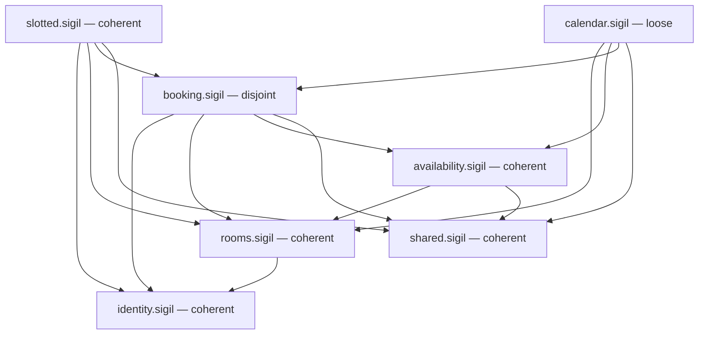
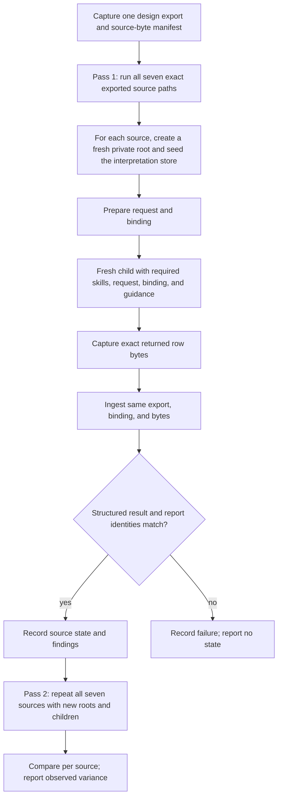

# Slotted computed-evaluation demo - Plan

## Goal Capsule

- **Objective:** A reader with no prior Sigil exposure can follow the demo doc, run the computed claims loop against a realistic multi-module design, and see the intended Coherent, Loose, and Disjoint gradient with structured findings and gate exit codes, alongside any variation observed across independent runs — then see what advisory review says about the same final design.
- **Means:** Build the demo on the maintainer's rewritten Slotted design: six components plus the SharedKernel kernel in shared.sigil, seven files in all. Fix its one remaining broken import (KTD1), plant the four deliberate problems in Booking and Calendar (KTD2), rewrite docs/computed-evaluation-demo.md and the README's Slotted section for the new files, and retarget the VS Code extension test (KTD9).
- **Product authority:** Repo maintainer's direction in the 2026-09-23/24 brainstorm session and the 2026-09-29 re-planning session, and the 2026-09-30 update after the maintainer added shared.sigil.
- **Execution profile:** code — a repo content change (design files, one test, and docs).
- **Open blockers:** None. `sigil check` currently fails with one unresolved-import error (rooms.sigil still imports `@design/identity.sigil`); U1 fixes it.
- **Who finishes:** the implementing agent or the maintainer, executing the Implementation Units below.

---

## Product Contract

Product Contract preservation — changed: R1, R3, R4, R5, R6, R8, R10, R15, R16, R17, F1. The maintainer replaced the Slotted design with six new all-prose components (Slotted, Identity, Rooms, Availability, Booking, Calendar), so every requirement that named old files now names the new ones. R2 is removed: the ASCII wireframe and SVG no longer exist. R16 now expects the VS Code extension test to change, because it opened the deleted `auth.sigil`. The six original Key Decisions still hold; two new ones are added.

2026-09-30 update: the maintainer then added shared.sigil (component SharedKernel) and moved the clock, the 30-minute grid, half-open ranges, and domain errors out of Availability into it. They also fixed most imports and removed the Slotted-to-Availability and app-layer import cycle. Changed by this update: R1, R3, R5, R6, R8, R10, R15, R17, and the units, tables, and diagrams that named six files. A third new Key Decision is added.

### Summary

Slotted becomes the worked demo of computed evaluation: a complete, all-prose room-booking design in six components plus a shared kernel file, with every facet anchored by a Tag and shared concepts reused from one owning component. The maintainer's rewrite is the base. The plan fixes its last broken import, plants four realistic problems in Booking and Calendar, and runs the claims loop on all seven files. A demo doc outside the example walks the computed gradient — Coherent, Loose, and Disjoint with structured findings and gate exit codes — then shows what sigil-evaluate finds in the same design. The example stays bare design files, so evaluation cannot read the answer key.

### Problem Frame

The claims loop is the repository's flagship computed capability. The first version of this demo shipped, but on a design the maintainer has since replaced. The new Slotted is a richer design: a booking lifecycle, a room lock, time-zone arithmetic, and a no-overlap rule. But nothing around it matches yet:

- One import, in rooms.sigil, still points at a `design/` folder that does not exist, so `sigil check` reports one error. The maintainer already fixed the other imports.
- None of the four deliberate problems survived the rewrite, so the demo has nothing to show beyond Coherent.
- docs/computed-evaluation-demo.md, the README's Slotted section, and the VS Code extension test all refer to deleted files (`auth.sigil`, `profile.sigil`, `user.sigil`, and others).

The first run also taught something. Across two passes, the ownership conflict never appeared, the dead-end step never produced an `unreached-step` finding, and Booking's contradiction appeared in only one pass. The new placement has to be phrased so the interpretation child reliably produces those claims.

### Key Decisions

- **Intentional problems live in the example itself.** (session-settled: user-directed — chosen over a coherent baseline plus a flawed variant: one source of truth, always re-runnable. Re-confirmed on 2026-09-29 over "no planted problems" and "only two problems".) Governs R7, R8, R9.
- **The example demos the complete finding-class spread.** (session-settled: user-directed — chosen over a single focused problem: "showcase all the problems" needs the taxonomy, not one instance.) Governs R5, R7, R8.
- **Mixed states across sources.** (session-settled: user-directed — chosen over uniform Disjoint or uniform Loose: the computed state belongs to the selected source, so the demo shows a gradient.) Governs R8.
- **The demo narrative is a narrative-only doc outside the example.** (session-settled: user-directed — chosen over an in-example README and committed run captures: the example stays bare design files, so advisory evaluation cannot read the documented problems.) Governs R9, R10, R11, R12, R13.
- **Interfaces are plain prose.** (session-settled: user-directed — chosen over TypeScript shapes: examples/promise/promise.sigil keeps signature-style interfaces.) The maintainer's rewrite already satisfies this. Governs R1, R4.
- **Design files are authored through the sigil-write skill.** (session-settled: user-directed — chosen over hand-editing: the example dogfoods the writer, and its delegated sigil-evaluate review joins the demo story.) Governs R14.
- **The maintainer's rewrite is the base design.** (session-settled: user-directed — the maintainer replaced the old nine files with six new ones and asked for the plan to follow.) Edits to it are limited to fixing imports, planting the four problems, and fixing unintended design findings. Governs R1, R5, R19.
- **SharedKernel is a kernel, not a module.** (session-settled: user-directed — the maintainer added shared.sigil and Slotted says any module may use the kernel without a dependency edge.) shared.sigil is a selected source like the others and is expected Coherent. Governs R1, R5, R8.
- **analyze-demo/ stays out of scope.** (session-settled: user-directed — chosen over rewriting its three docs for the new runs or deleting them.) Their links to deleted files stay broken until separate work handles them.

### Actors

- A1. Demo reader — a newcomer or coding agent following the demo doc with the repo checked out.
- A2. sigil-write — authors and revises the design files, delegating each review to a fresh sigil-evaluate child.
- A3. sigil-compute — the host-run claims loop: sigil-claims prepare/ingest plus one fresh interpretation child per run.
- A4. sigil-evaluate — advisory reviewer on direct request; returns prose findings with no computed state and no gate.

### Requirements

**Design base**

- R1. The seven Slotted files carry only ordinary prose facets, and each concept has one owning component: Identity owns users, sessions, the signed-in user, and the session gate; Rooms owns rooms, room owners, the room timezone, archiving, and the room lock; Availability owns weekly windows, blackouts, and open time; SharedKernel owns the clock, the 30-minute grid, local and UTC time values, half-open ranges, and domain errors; Booking owns booking requests, their lifecycle, the no-overlap rule, and the cross-module booking workflows; Calendar owns the room calendar.
- R3. Every import names a file in the workspace root (for example `@identity.sigil` or `@shared.sigil`), and every imported Tag resolves to its owning component.
- R4. Technology commitments (Next.js, PostgreSQL 18, Drizzle ORM, Better Auth, the Temporal polyfill, Vitest, Playwright) stay prose constraints and decisions.
- R5. Design files exist for every module Slotted names — Slotted (the root), Identity, Rooms, Availability, Booking, and Calendar — and for the SharedKernel kernel. Each is a Sigil 0.9 component with prose facets.
- R6. Modules respect the boundaries Slotted states: only Booking may call a transaction entry, the app layer uses only public entries, and module dependencies follow Slotted's allowed list with no cycle, and any module may use SharedKernel.
- R19. Beyond the four planted problems, an unintended design finding from the writer's review or the claims loop is fixed in the design prose, not just reported. Valid run-to-run variance is still reported, never forced away (R15).

**Intentional problem spread**

- R7. The example deliberately contains realistic problems covering the four designable finding classes: one contradiction, one ownership conflict, one unmet obligation, and one flow-class unreached step. Each reads as a plausible design mistake a real author could make.
- R8. The problems are placed to target a per-source state gradient: slotted.sigil, identity.sigil, rooms.sigil, availability.sigil, and shared.sigil are expected Coherent; calendar.sigil is expected Loose with a flow warning and no contradiction; booking.sigil is expected Disjoint with a gate failure. Observed outcomes are reported under R13; they are not a guarantee for future model runs.
- R9. Every intentional problem is marked as intentional in the demo doc and in the root README's Slotted paragraph, so no later author "fixes" the fixture unknowingly.

**Demo doc**

- R10. docs/computed-evaluation-demo.md is rewritten for the seven-file design. It tells the demo story: what the example is, the module map, which intentional problem triggers which finding class in which source, the exact commands (export, prepare, ingest), and the expected state and exit code per source. Results from the replaced design are removed.
- R11. The demo doc explains the remedy for each intentional problem — as prose or diffs — and the state the design returns to, without committing a second fixed variant.
- R12. The demo doc contrasts computed and advisory evaluation on the same final design snapshot: the claims loop's state, structured findings, and exit-code gate versus a separate fresh sigil-evaluate review's advisory prose with no state and no gate, and when each is the right tool. Per-file writer reviews are authoring evidence, not the final whole-design comparison.
- R13. The demo doc states that interpretation is a model run and reports the outcomes of two independent computed gradients against one captured export. The intended states and finding classes are expected outcomes, not guarantees. It also reports each prepare's presented/reused counts. The doc describes observed divergence and makes no claim about future runs.

**Authoring and verification**

- R14. All .sigil changes are authored through the sigil-write skill loop — mechanical check, format of authored files, recheck, delegated fresh sigil-evaluate review — with the intentional problems preserved as documented deliberate content rather than corrected away.
- R15. Implementation runs two independent complete claims gradients over each of the seven Slotted files against one captured export per settled design revision. It records each source's actual state, finding classes, and prepare presented/reused counts. Run records are not committed.
- R16. Mechanical health holds after the change: `sigil check` passes on the slotted workspace, the core suite passes unchanged, and the VS Code extension test is retargeted to a new Slotted file and passes.

**Tag precision and reuse**

- R18. Every facet in the Slotted workspace introduces or references at least one precise Tag. A concept has one owning component; other components reuse it through explicit Tag imports rather than defining a duplicate. Choose existing owning Tags wherever they name the intended concept, and add a local Tag only for genuinely new vocabulary.

**Root README**

- R17. README.md's Examples section describes Slotted's demo role, its six components, and the SharedKernel file, marks the intentional problems as deliberate fixture content, and links the demo doc. It no longer names deleted files.

### Key Flows

- F1. Reader runs the computed gradient
  - **Trigger:** A1 follows docs/computed-evaluation-demo.md.
  - **Actors:** A1, A3
  - **Steps:** The demo doc directs the reader to run the claims loop on a clean source (rooms.sigil), then calendar.sigil, then booking.sigil.
  - **Outcome:** The reader sees the intended progression of coherent (exit 0, no findings), loose (exit 0, unmet-obligation and unreached-step warnings), and disjoint (exit 1, contradiction and ownership-conflict findings); the doc reports the states and findings actually observed in its two runs.
  - **Covers:** R8, R10.
- F2. Reader contrasts advisory review
  - **Trigger:** A1 asks for a design review of the same example.
  - **Actors:** A1, A4
  - **Steps:** The demo doc shows what sigil-evaluate returns for the same intentional problems and how advisory findings differ from the loop's structured report.
  - **Outcome:** The reader understands when each skill fits: a computed gate versus advisory judgment.
  - **Covers:** R11, R12.
- F3. Author preserves the intentional problems
  - **Trigger:** A2 drafts or revises the design files.
  - **Actors:** A2, A3, A4
  - **Steps:** A2's delegated review surfaces the intentional problems as findings; A2 preserves them because the demo doc and root README mark them deliberate; verification runs confirm the gradient still computes.
  - **Outcome:** The fixture keeps its documented problem spread through authoring and review.
  - **Covers:** R9, R14, R15.

### Acceptance Examples

- AE1. **Covers R7, R8, R15.** **Given** the updated workspace, **When** two independent completed runs cover a clean source, **Then** each coherent result is reported as observed and any different valid result is disclosed rather than discarded.
- AE2. **Covers R7, R8, R15.** **Given** the updated workspace, **When** two independent completed runs cover calendar.sigil, **Then** each loose result with its unmet-obligation and unreached-step warnings is reported as observed, and any different valid result is disclosed rather than discarded.
- AE3. **Covers R7, R8, R15.** **Given** the updated workspace, **When** two independent completed runs cover booking.sigil, **Then** each disjoint result includes contradiction findings citing both conflicting facets and the ownership-conflict evidence, while any different valid result is disclosed.
- AE4. **Covers R12.** **Given** the same final design snapshot, **When** the reader runs sigil-evaluate, **Then** the separate review returns advisory prose naming the intentional problems, with no computed state and no exit-code gate.
- AE5. **Covers R10, R12, R13.** **Given** only the repo and the demo doc, **When** a reader follows the doc's commands, **Then** they can reproduce the protocol and understand the observed outcomes and any disclosed run-to-run variance without needing other documentation.

### Scope Boundaries

- The skills themselves stay untouched: no changes to sigil-compute, sigil-evaluate, sigil-write, sigil-understand, or sigil-egglog content.
- examples/promise stays untouched; it keeps the repo's signature-style interface coverage.
- No real application code: the example stays design-only, and the stack names stay prose commitments.
- No committed raw claims-run records or separate verification reports beyond docs/computed-evaluation-demo.md; no CI or test pins the example's computed states.
- No README or other explanatory file inside examples/slotted.
- analyze-demo/ is not edited (see Key Decisions).
- The core suite's Slotted test uses an in-memory copy of the old files, not the real example, so it stays unchanged.

### Dependencies / Assumptions

- Tooling is present: build/sigil exists, and the `sigil-claims` binary builds under packages/sigilc.
- Verification runs need a host that can delegate a fresh interpretation child for each source run; the final advisory comparison also needs a separate fresh evaluator. If either is unavailable, report that limit and do not describe the missing result as verified.
- The claims laws decide actual states: a crafted problem may not trip its intended law on the first pass. Facet prose iterates during verification until each intended class surfaces (KTD7).
- One claims run covers one selected source, with its import closure as context; each intentional problem lives in the source whose run must expose it.
- Import cycles are allowed (spec/sigil-reference.md, "Cycles"), but the current design has none.

### Outstanding Questions

- **Deferred to implementation:** the exact facet prose for each intentional problem. It iterates against real claims runs until the intended classes surface (R15, KTD7).

### Sources / Research

- integrations/skills/sigil-compute/references/computed-evaluation.md — the loop contract: states, exit codes, finding classes, one-source-per-run.
- docs/computed-evaluation-demo.md (the pre-rewrite version) — observed lessons: the ownership conflict never appeared, the dead-end step produced `suppressed-graph` or nothing instead of `unreached-step`, and Booking's contradiction appeared in one pass of two.
- packages/sigilc/src/claims/guidance/examples.md — the exclusivity pattern: an ownership claim plus an `exclusive` property, from prose like "the only one whose…".
- packages/sigilc/src/claims/guidance/vocabulary.md — flow steps and edges: an edge to `graph` declares an end, and ending is declared, never inferred.
- packages/sigilc/src/claims/findings.rs and packages/sigilc/src/claims/claims.egg — gate semantics and attribution: only contradiction and ownership-conflict findings make Disjoint; a finding is retained only when the selected source authored one of its cited claims.
- spec/glossary.md ("Import", "Import cycle") — `@path` imports resolve from the workspace root; cycles are allowed.
- integrations/editor/vscode/tests/extension/index.ts — opens `auth.sigil`, hovers the `UserProfile` import and a section component reference, and pins the compile report's roots and sources.
- packages/core/tests/core_test.ts — its Slotted workspace test uses in-memory files, not the real example.
- README.md, "Examples" section — the Slotted text that R17 rewrites.
- integrations/skills/sigil-write/references/writing-loop.md — the authoring loop the units execute.
- docs/quickstart.md — the command-first documentation style the demo doc follows.

---

## Planning Contract

### Key Technical Decisions

- KTD1. **Imports are rewritten in place; the files stay in the workspace root.** Each `@design/<file>.sigil` becomes `@<file>.sigil`; only rooms.sigil line 1 is left. The seven filenames stay as the maintainer chose them. (session-settled: user-directed — chosen over moving all seven files into examples/slotted/design/: keeps the flat layout the README and tests already expect.) Governs R3; instantiated in U1.
- KTD2. **Problem placement follows the witness-attribution rule.** Ingest keeps a finding only when the selected source authored one of its cited claims. So each problem lives in the one source whose run must show it:
  1. The contradiction is authored wholly inside booking.sigil: an interface promise and a constraint that forbids it. A cross-file contradiction would make both files Disjoint.
  2. The ownership conflict centres on Rooms' `archived room` Tag. booking.sigil claims the archived-room mark is Booking's alone, because only Booking's archive workflow may change it. rooms.sigil states that Rooms owns it. The exclusivity marker lives in booking.sigil, so only Booking's report carries the conflict.
  3. calendar.sigil authors both warnings: a requirement nothing provides, and a logic step whose output nothing uses.
  Calendar is a leaf that no other file imports, so its warnings cannot be cited by another source's claims. (session-settled: user-approved — chosen over putting the warnings in Availability.) Governs R7, R8; instantiated in U2, U3, U4.
- KTD3. **All seven files are selected sources, slotted.sigil and shared.sigil included.** The old root file was context only. The new root and the kernel carry real constraints, decisions, and cases, so both are run and expected Coherent. (session-settled: user-approved — chosen over treating slotted.sigil as context only.) Governs R8, R15.
- KTD4. **Authoring executes the sigil-write writing loop mechanically.** (session-settled: user-directed — chosen over hand-editing.) Check and format authored files against examples/slotted as the workspace root, recheck, capture exact bytes, and delegate a fresh sigil-evaluate child after each draft or semantic revision. Determined corrections apply autonomously; the intentional problems land as design choices the writer preserves. Record the actual host restrictions, including when read-only is instruction-only. Governs R14.
- KTD5. **Verification runs the claims loop under the compute contract's private-root discipline.** For each settled design revision, capture one export from the slotted workspace and select the seven sources by their exact `sources[].path` values. Keep a scratch manifest of source-file byte hashes. Each selected-source run uses its own private root outside the workspace, seeded from the workspace interpretation store. The fresh child has no inherited conversation. It receives only the prepared request, binding, every prepared guidance path, and the resolved `sigil-understand` and `sigil-egglog` entrypoints, and returns data-only rows through its assigned artifact. Record actual child restrictions. A state counts only after the completed-ingest identity checks pass. Governs R15, AE1–AE3.
- KTD6. **Repeat the full gradient to measure observed model variance.** Run two independent complete gradients (seven source runs each) against KTD5's one export, with a fresh private root and child for every source in each pass. Compare states and finding classes source by source. Do not alter settled design choices only to force identical model output. Do not commit run artifacts. Governs R13, R15.
- KTD7. **Phrase the planted problems the way the interpretation guidance reads them.** The first run showed that loose phrasing loses the ownership conflict and the dead-end step. So:
  1. Ownership: booking.sigil states both halves the exclusivity pattern needs — that Booking owns the archived-room mark, and that Booking is the only one that may set or clear it. rooms.sigil states plainly that Rooms owns the archived-room mark.
  2. Dead-end step: in Calendar's logic, every other step reaches an explicit end ("returns the room calendar"). The planted step writes a Tag that no later step reads, the interface never returns, and no sentence ends the flow.
     Observed 2026-09-30: the interpreter treats a step that writes a Tag as a declared end, so a step that only writes did not produce `unreached-step`. The planted step now only compares the owner digest with the previous one, and writes and returns nothing. It still surfaced in only some runs.
  3. Unmet obligation: a firm requirement in a committing section, such as the room owner's view needing a renter display name, which no component provides.
  4. Contradiction: an interface promise and a constraint phrased as a required-false form, both about the same Tag in booking.sigil.
     Observed 2026-09-30: the guidance says a claim may only name a Tag marked with asterisks in that facet, but an asterisk defines a new Tag, so existing Tags cannot be marked. Interpreters split on this rule, and Booking's contradiction and ownership conflict appeared in one pass of two.
  Governs R7; instantiated in U3, U4.
- KTD8. **Unintended findings are fixed in the design prose.** (session-settled: user-approved — chosen over only reporting them.) One known candidate: Slotted's allowed-dependency list gives Booking only Availability and Rooms, but booking.sigil imports `signed-in user` from Identity. It is unconfirmed until the check and the writer's review run. Fixes go through the writer loop and never remove a planted problem. Governs R19.
- KTD9. **The extension test is retargeted to booking.sigil.** booking.sigil has a multi-Tag import list and a component reference in prose ("Booking depends on Availability"), which are the two things the test hovers. Its import closure spans Identity, Rooms, and Availability, so the compile-report source assertions stay meaningful. The native compile state is observed on the new file and pinned as found, not assumed to stay Loose. Governs R16; instantiated in U8.

### High-Level Technical Design

The target is a state gradient across one workspace. The table shows intended outcomes; U5 records what each pass actually produced.

| Selected source | What its own prose authors | Expected findings | State (exit) |
| --- | --- | --- | --- |
| slotted.sigil | module map, boundaries, stack | none | coherent (0) |
| identity.sigil | users, sessions, session gate | none | coherent (0) |
| rooms.sigil | rooms, archiving, room lock, and a plain "Rooms owns the archived-room mark" | none | coherent (0) |
| shared.sigil | clock, 30-minute grid, time conversion, domain errors | none | coherent (0) |
| availability.sigil | weekly windows, blackouts, open time | none | coherent (0) |
| calendar.sigil | room calendar plus unmet requirement and dead-end step | one unmet-obligation, one unreached-step (warnings) | loose (0) |
| booking.sigil | lifecycle plus in-file contradiction and exclusive archived-room claim | contradiction rows citing both facets, one ownership-conflict, and possibly one `exclusive-foreign-write` flow warning | disjoint (1) |

Imports after U1 (arrows mean "imports Tags from"):

Booking imports `archived room` from Rooms, so Booking's run sees both ownership claims. The same exclusivity marker also meets the step-ownership law in packages/sigilc/src/claims/claims.egg: Booking's archive-workflow step writes a Tag that Rooms defines, so Booking's report may carry one `exclusive-foreign-write` flow warning. That warning is part of the planted ownership problem, and flow warnings never gate, so the state stays Disjoint. Slotted does not import `archived room` and says only that Booking's workflows reach archive; the ownership finding is expected to cite only Booking's exclusivity marker, so Slotted should stay Coherent. U5 checks this.

Run protocol per settled revision:

### Sequencing

1. U1 first — nothing else can be checked until imports resolve.
2. U2, then U3 and U4 in either order. shared.sigil needs no planted problem; U2 only tightens it if the writer review asks. U4 needs U2's Rooms ownership sentence.
3. U8 runs after U5, once booking.sigil's content is final, so the compile state it pins does not go stale.
4. U5 runs after U2–U4. It may loop back into U2–U4 for unintended findings (KTD8). Any semantic edit restarts both passes with a new export.
5. U6 follows the last semantic edit. A later semantic edit requires another fresh advisory review.
6. U7 last.

---

## Implementation Units

### U1. Fix Slotted imports and get the workspace green

- **Goal:** All seven Slotted files resolve, and `sigil check` passes with no diagnostics.
- **Requirements:** R1, R3, R4, R6, R16, R18
- **Dependencies:** none
- **Files:** examples/slotted/slotted.sigil, examples/slotted/identity.sigil, examples/slotted/rooms.sigil, examples/slotted/shared.sigil, examples/slotted/availability.sigil, examples/slotted/booking.sigil, examples/slotted/calendar.sigil
- **Approach:**
  1. Rewrite the one remaining `@design/identity.sigil` import in rooms.sigil as `@identity.sigil` (KTD1).
  2. Run the check and fix what it reports next: unresolved Tag selections, unused imports, and untagged facets (R18).
  3. Format the seven files, recheck, and run the writer's delegated review (KTD4). Apply determined corrections, including KTD8 fixes such as the dependency list that omits Booking on Identity.
- **Patterns to follow:** examples/promise/.sigil/config.json and the README's note that `@` imports resolve from the workspace directory.
- **Test scenarios:**
  - `sigil check examples/slotted` reports zero errors and zero warnings.
  - Each selected Tag in every import list resolves to the component that defines it.
  - Every facet in the seven files references or defines a Tag.
  - `sigil fmt --check` is clean on the seven files.
- **Verification:** the workspace checks and formats clean, and the writer's review found no unresolved design issue other than the ones U2–U4 will plant.

### U2. Tighten the four clean sources

- **Goal:** slotted.sigil, identity.sigil, rooms.sigil, shared.sigil, and availability.sigil are ready to compute Coherent, and rooms.sigil states the ownership that Booking's conflict needs.
- **Requirements:** R6, R8, R18, R19
- **Dependencies:** U1
- **Files:** examples/slotted/rooms.sigil; examples/slotted/slotted.sigil, examples/slotted/identity.sigil, examples/slotted/shared.sigil, and examples/slotted/availability.sigil only where the writer review finds an unintended issue
- **Approach:** Author through the writer loop (KTD4). Add a plain sentence to rooms.sigil saying Rooms owns the archived-room mark (KTD7 item 1); today it only says a room is listed or an archived room. Do not state exclusivity there. Keep other edits to fixes of unintended issues (KTD8).
- **Patterns to follow:** the ownership phrasing already in slotted.sigil's interface.
- **Test scenarios:**
  - Target: each of the five clean sources is Coherent, exit 0, with zero findings in each pass. Covers AE1.
  - rooms.sigil's own run does not report an ownership conflict, because it authors no exclusivity marker.
  - `sigil check` stays green.
- **Verification:** the five sources are checked, formatted, and reviewed; U5 records their actual states.

### U3. Plant the two warnings in calendar.sigil (the loose source)

- **Goal:** Calendar hosts one unmet obligation and one dead-end logic step, and nothing else.
- **Requirements:** R7, R8, R18
- **Dependencies:** U1
- **Files:** examples/slotted/calendar.sigil
- **Approach:** Author through the writer loop (KTD4). Add the two problems as plausible mistakes (KTD2 item 3), phrased per KTD7 items 2 and 3:
  1. The unmet obligation: the room owner's view requires a renter display name. Identity has no profile (a user account has only an email and a credential), so nothing provides it. Calendar's current text says only "renter identity", which Booking's renter provides, so this is a new sentence.
  2. The dead-end step: a logic step that records a new Tag nothing reads or returns, among steps that each reach an explicit end. Calendar's existing six-step view ends with "returns the calendar view to the caller", which supplies the ended steps; add the dead-end step as its own paragraph.
- **Execution note:** Verify both only through real claims runs. The first attempt at a dead-end step never produced `unreached-step`, so expect to iterate the step prose.
- **Patterns to follow:** packages/sigilc/src/claims/guidance/vocabulary.md for step edges and declared ends.
- **Test scenarios:**
  - Target: calendar.sigil is Loose, exit 0, with one unmet-obligation and one unreached-step warning and no contradiction in each pass. Covers AE2.
  - The two problems survive the writer's delegated review as design choices. Covers F3.
  - No other source's report carries Calendar's warnings.
- **Verification:** the target is Loose with exactly the two intended warnings, or the actual result is recorded for U6.

### U4. Plant the two gating problems in booking.sigil (the disjoint source)

- **Goal:** Booking hosts one in-file contradiction and one exclusive-ownership over-claim, and nothing else.
- **Requirements:** R7, R8, R18
- **Dependencies:** U2 (Rooms' ownership sentence)
- **Files:** examples/slotted/booking.sigil
- **Approach:** Author through the writer loop (KTD4). Add the problems per KTD2 items 1–2 and KTD7 items 1 and 4:
  1. The contradiction: an interface promise that a constraint forbids. Nothing in the current text contradicts itself, so both halves are new. One candidate: the interface lets a renter change the requested range of their own Pending booking request, while a constraint says a requested range must never change after it is recorded.
  2. The ownership over-claim: Booking owns the archived-room mark and is the only one that may set or clear it. Booking's current archive workflow only says it calls Rooms' archive mutation, and no facet claims ownership, so both halves are new text. This is the over-claim of a team that moved archiving into Booking's archive workflow.
  3. Keep every other promise met, so no unintended unmet obligations appear.
  4. Keep the archive workflow's write of the archived-room mark. It may add an `exclusive-foreign-write` flow warning, which belongs to the planted ownership problem; do not remove the write to silence it, because Booking owns the archive workflow (R1).
- **Execution note:** Iterate against real claims runs until the report carries the contradiction rows, the ownership conflict, and at most the `exclusive-foreign-write` warning, and nothing else. The first design's contradiction appeared in only one pass of two.
- **Patterns to follow:** the exclusivity pattern and required-false forms in packages/sigilc/src/claims/guidance/examples.md.
- **Test scenarios:**
  - Target: booking.sigil is Disjoint, exit 1, with contradiction findings citing both facets and one ownership-conflict finding in each pass. Covers AE3.
  - No unmet-obligation findings, and no flow findings other than the `exclusive-foreign-write` warning from the planted exclusivity marker, appear in Booking's report.
  - slotted.sigil and rooms.sigil stay Coherent even though their prose also names Rooms as the archiving owner.
- **Verification:** the target is Disjoint with exactly the intended findings, or the actual result is recorded for U6.

### U5. Confirm the computed gradient in two independent runs

- **Goal:** Measure whether every source produces its intended state and finding classes across two independent gradients against the same export.
- **Requirements:** R7, R8, R15, R19
- **Dependencies:** U2, U3, U4
- **Files:** none new; prose fixes to U2–U4 outputs as findings require
- **Approach:** Follow KTD5 and KTD6 for all seven sources.
  1. Capture one export and its source-byte manifest.
  2. Run pass 1 and pass 2, each with a fresh private root and child per source. Record prepare's presented and reused counts.
  3. Count a state only when result, report, binding, artifact, and private-root identities all match. A bare exit 1 or a failed handoff gives no state.
  4. Fix unintended findings through U2–U4 (KTD8). After any semantic edit, discard both passes and start again with a new export.
  5. If valid runs still disagree, record the variance for U6.
  Keep all inputs, reports, and roots outside the repo.
- **Test scenarios:**
  - Target map: slotted, identity, rooms, availability, and shared Coherent; calendar Loose with its two warnings; booking Disjoint with its contradiction and ownership conflict, plus at most the `exclusive-foreign-write` flow warning. Covers AE1–AE3.
  - Every counted ingest passes the identity checks; mismatched or incomplete ingests are failures, not variance.
- **Verification:** two complete gradients (fourteen source runs) on one immutable export, with counts, child restrictions, and outcomes recorded per source.

### U6. Rewrite the demo doc and run a separate final advisory review

- **Goal:** docs/computed-evaluation-demo.md presents the seven-file design, both observed gradients, and an advisory review of the same final design.
- **Requirements:** R9, R10, R11, R12, R13
- **Dependencies:** U5
- **Files:** docs/computed-evaluation-demo.md
- **Approach:** After the last semantic edit, capture the final design bytes and check them against U5's manifest; if they differ, repeat U5. Dispatch a separate fresh `sigil-evaluate` child on those bytes and record its actual restrictions (KTD4). Then replace the doc's content, removing every result from the replaced design:
  1. What the example is, the six-component module map, and the SharedKernel file.
  2. The four intentional problems: which source, which finding class, and the marker that they are deliberate. For the ownership conflict, point to Booking's exclusivity sentence and both ownership statements.
  3. The commands with real binary paths and the seven `--source` values exactly as the export lists them.
  4. Target and actual state, exit code, finding classes, and prepare counts per source per pass.
  5. The remedy for each problem and the expected return state (R11).
  6. The computed-versus-advisory contrast on the same bytes (R12).
  7. The variability note (R13).
- **Patterns to follow:** docs/quickstart.md's command-first style; the section order of the current demo doc.
- **Test scenarios:**
  - Test expectation: none — documentation unit; U7 proves accuracy by running the doc's commands.
- **Verification:** the doc names only the seven current files, reports U5's actual outcomes without hiding divergence, and its advisory review matches the final design bytes.

### U8. Retarget the VS Code extension test to booking.sigil

- **Goal:** The extension integration test opens a file that exists and asserts on its real imports and compile report.
- **Requirements:** R16
- **Dependencies:** U5 (booking.sigil's final content)
- **Files:** integrations/editor/vscode/tests/extension/index.ts
- **Approach:** Per KTD9:
  1. Open booking.sigil instead of auth.sigil.
  2. Hover and go-to-definition on a Tag in booking.sigil's Rooms import list, expecting its Rooms owner.
  3. Hover and go-to-definition on the component reference in "Booking depends on Availability", in place of the old "Auth uses UserProfile" fixture.
  4. Pin the compile report's root as booking.sigil and its sources as including rooms.sigil, availability.sigil, identity.sigil, and shared.sigil.
  5. Observe the native compile state and diagnostic code on the real file and pin those values.
  6. Point the selection file at booking.sigil.
- **Execution note:** Run the suite once against the new file before changing assertions, so the pinned state comes from the real report.
- **Patterns to follow:** the existing assertions in the same file.
- **Test scenarios:**
  - Opening booking.sigil gives language id `sigil`, and the retained commands are registered.
  - Hover on the first Rooms import Tag (`room`) includes that Tag's name; go-to-definition returns a location in rooms.sigil.
  - Hover and definition on "Availability" in Booking's logic prose both return results.
  - The design compile report lists booking.sigil as its only root and includes its four imported files (identity.sigil, rooms.sigil, availability.sigil, shared.sigil) as sources.
  - The existing missing-executable, dirty-document, and unavailable-comparison checks still pass unchanged.
- **Verification:** `deno task test:vscode:extension` passes against the updated example.

### U7. Update the root README and run the final sweep

- **Goal:** The root README presents the new demo accurately and links the doc; all mechanical and behavioral checks are green.
- **Requirements:** R16, R17
- **Dependencies:** U6, U8
- **Files:** README.md
- **Approach:** Rewrite the Slotted paragraphs in the Examples section (R17): link slotted.sigil as the root, describe the six components, the SharedKernel file, and who owns what, mark the four problems as deliberate fixture content, and link the demo doc. Remove links to deleted files. Keep the edit scoped to the Slotted paragraphs.
- **Test scenarios:**
  - Every examples/slotted link in README.md points at an existing file.
  - The demo doc's commands, executed as written with fresh private roots, reproduce the documented protocol. Covers AE5.
  - `deno task test:core` passes.
  - `deno task test:vscode:extension` passes.
  - `sigil check` on the slotted workspace passes; `sigil fmt --check` is clean on the seven files.
- **Verification:** all suites green, the gradient reproduces from the doc's commands, and the README marks the intentional problems.

---

## Verification Contract

| Check | Command or discipline | Proves |
| --- | --- | --- |
| Mechanical validation | `build/sigil check examples/slotted --format json` (rebuild with `deno task build:cli` if the binary is absent) | R3, R16, R18 |
| Formatting of authored files | `build/sigil fmt` on the seven `.sigil` files, then `--check` after the recheck | R14 |
| Computed gradient | KTD5/KTD6: one export and manifest; two complete gradients over seven sources with fresh roots and children; identity checks on every counted ingest | R8, R13, R15, AE1–AE3 |
| Core suite | `deno task test:core` | R16 |
| Extension suite | `deno task test:vscode:extension` | R16 |
| Advisory comparison | Separate fresh `sigil-evaluate` review of the captured final design bytes, matching the computed export's manifest | R12 |
| Doc accuracy | Execute docs/computed-evaluation-demo.md's commands as written | R10, R13, AE5 |
| Link check | Every examples/slotted path in README.md and the demo doc exists | R10, R17 |

The claims runs require a host that can delegate one fresh interpretation child per source run, loaded with sigil-understand and sigil-egglog. An exit 1 from ingest is a verdict only with a matching structured Disjoint result and report. No new test pins the fixture's computed outcomes.

## Definition of Done

- All eight units landed; no launch-blocking question remains.
- `sigil check` passes with zero diagnostics on the seven-file workspace, and `sigil fmt --check` is clean.
- Two independent gradients use one captured export and separate private roots per source run. The doc reports whether each run matched the target map — five Coherent, calendar.sigil Loose, booking.sigil Disjoint — and discloses any valid variance.
- The core suite passes unchanged, and the retargeted extension test passes.
- docs/computed-evaluation-demo.md and README.md name only current files, mark the four problems as deliberate, and the doc's commands run as written.
- examples/slotted contains only the seven design files and its config; run records and scratch artifacts stay outside the repo; abandoned experimental prose is removed.
