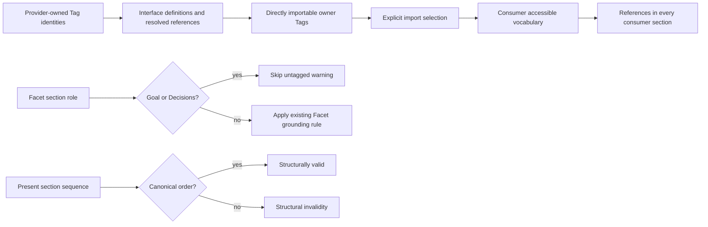

# Interface Tag Visibility - Plan

## Goal Capsule

- **Objective:** Align Sigil contract structure, Tag grounding, and import visibility with contract intent: sections follow one required order, Goal and Decisions prose may remain untagged, operational Facets remain Tag-grounded, and only Tags exposed by a component's Interface can be imported from their original owner.
- **Means:** Enforce the section order `goal`, `state`, `logic`, `constraints`, `cases`, `interface`, `decisions`; treat valid Tag definitions or resolved uses in a provider's Interface as its export boundary while preserving direct owner imports and all-section consumer reuse.
- **Product authority:** The Sigil language contract and its compiler/editor diagnostics define the behavior.
- **Execution profile:** Code change with normative contract, fixture, and migration updates.
- **Completion owner:** The implementation plan is complete when the implementation units and verification gates below are satisfied.
- **Open blockers:** None.

---

## Product Contract

### Summary

Make contract structure deterministic and refine Tag visibility so a component's Interface acts as the public boundary for its component-owned Tags. Present sections must follow `goal`, `state`, `logic`, `constraints`, `cases`, `interface`, `decisions`; `goal` and `decisions` are exempt from untagged-Facet warnings, the remaining contract sections stay Tag-grounded, and direct imports from the originating component remain the only import path.

### Problem Frame

The current advisory rule warns on untagged Facets in every section, including sections whose purpose is to explain intent and rationale. The current import rule exposes every component-owned Tag regardless of where it is introduced, so implementation-oriented or internal vocabulary can become importable without appearing in the provider's public Interface.

### Key Decisions

- **Interface as export boundary** (session-settled: user-approved — chosen over explicit export syntax: using or defining a Tag in `interface` is the intended export signal). Governs R4, R5.
- **Direct owner imports** (session-settled: user-directed — chosen over transitive re-export: the Tag's originating component remains its import authority). Governs R7.
- **All-section consumer reuse** (session-settled: user-approved — chosen over restricting imported Tags to consumer Interfaces: a selected Tag remains usable throughout the consumer contract). Governs R6.
- **Required section order** (session-settled: user-directed — chosen over permissive presentation order: section order is part of contract validity). Governs R8.

### Requirements

**Facet grounding**

- R1. `goal` and `decisions` Facets do not receive `SIGIL_UNTAGGED_FACET` warnings solely because their own eligible prose has no resolved Tag reference or valid inline Tag definition.
- R2. `interface`, `state`, `logic`, `constraints`, and `cases` Facets continue to receive the advisory warning when their own eligible prose has neither a resolved Tag reference nor a valid inline Tag definition.
- R3. The existing grounding definition remains in force for R2: a grouping heading alone, an ambiguous reference, a fenced payload, a complete link, or a component mention does not satisfy the Facet's Tag requirement, and incomplete source recovery suppresses the absence-based warning.

**Interface Tag visibility**

- R4. A component-owned Tag is directly importable only when that same component's `interface` contains either a valid Tag definition or a resolved eligible-prose reference to the Tag; valid Interface grouping headings count as definitions.
- R5. A Tag introduced or used only outside `interface` is not importable from that component, and an attempted selection remains an unresolved imported-Tag result without making the Tag accessible.
- R6. A component may use an imported Tag in any contract section, including `goal`, `interface`, `state`, `logic`, `constraints`, `decisions`, and `cases`, subject to the existing selected-import and Facet-grounding rules.
- R7. Using an imported Tag in a component's `interface` does not transfer ownership or make the Tag importable from that component; another component must import it directly from the original owner.

**Section structure**

- R8. When present, a component's sections must appear in the exact order `goal`, `state`, `logic`, `constraints`, `cases`, `interface`, `decisions`; any other ordering is invalid.

**Compatibility and contract consistency**

- R9. Existing import behaviors that are independent of export eligibility remain unchanged, including exact-name identity, duplicate and collision handling, unused-selection diagnostics, protected prose regions, and preservation of independent valid selections.
- R10. The normative language reference, implementation-facing contracts, CLI/LSP diagnostics, tests, and examples describe the required section order, Interface export boundary, and Goal/Decisions warning exemption.

### Acceptance Examples

- AE1. A Tag-free `goal` Facet produces no `SIGIL_UNTAGGED_FACET` warning.
- AE2. A Tag-free `decisions` Facet produces no `SIGIL_UNTAGGED_FACET` warning.
- AE3. A Tag-free `state`, `logic`, `constraints`, `cases`, or `interface` Facet still produces one `SIGIL_UNTAGGED_FACET` warning.
- AE4. A Facet whose only Tag is its grouping heading still produces the warning in the sections governed by R2.
- AE5. A Tag defined only in `state` cannot be selected by another component and yields the existing unresolved-imported-Tag result.
- AE6. A Tag defined outside `interface` becomes directly selectable when its provider's `interface` contains a resolved eligible-prose reference to that Tag.
- AE7. A Tag defined inline or by a grouping heading in `interface` can be directly selected by another component.
- AE8. After a valid direct import, the consuming component can reference the Tag in every contract section without an interface-only restriction.
- AE9. If component B uses a Tag owned by component A in B's `interface`, component C cannot import that Tag from B; C can import it directly from A.
- AE10. An imported Tag selected and used in a consumer's `goal` or `decisions` remains valid use even though those sections are exempt from the untagged-Facet warning.
- AE11. A component containing all seven sections in the order `goal`, `state`, `logic`, `constraints`, `cases`, `interface`, `decisions` is structurally valid.
- AE12. A component that places a present section out of that order is structurally invalid rather than being accepted as an alternate presentation.

### Scope Boundaries

- No new export syntax, aliases, namespaces, wildcard imports, or runtime-access policy.
- No transitive Tag re-export; Interface usage exposes only Tags owned by that same component for direct selection from that owner.
- No restriction on which consumer sections may use a successfully selected imported Tag.
- No change to the existing rule that grouping headings do not count as a Tag in a Facet's own prose for the untagged-Facet advisory.
- No alternate section ordering; the order requirement applies to the sections that are present, while existing optional-section rules remain otherwise unchanged.

### Dependencies / Assumptions

- The change alters language-level import eligibility and advisory coverage; planning must apply the repository's existing language-version and migration policy for accepted semantic changes.
- `SIGIL_UNTAGGED_FACET` remains advisory: affected sources stay structurally valid when the warning is absent or present.

### Sources / Research

- `spec/sigil-reference.md:538-551` defines eligible Tag recognition and the current Facet warning rule.
- `spec/sigil-reference.md:71-87` defines the seven sections and the current permissive section-order rule that this change replaces.
- `spec/sigil-reference.md:580-615` defines current import ownership, all-contract import use, and the existing no-re-export boundary.
- `spec/language.sigil:256-278` records the current Tag identity and import semantics that this change refines.
- `packages/core/src/resolver.ts:60-116` collects Tag introductions from all sections, while `packages/core/src/resolver.ts:270-301` currently accepts any resolved provider-owned Tag selection.
- `packages/core/src/resolver.ts:488-523` owns the host-facing untagged-Facet diagnostic calculation.
- `packages/core/tests/tag_resolution_test.ts:278-328` covers current all-section import use and should provide the baseline for the revised visibility cases.
- `packages/cli/tests/cli_test.ts:438-466` covers current untagged-Facet warning behavior.

---

## Planning Contract

Product Contract preservation: Product Contract unchanged.

### Key Technical Decisions

- KTD1. **Derive import eligibility from provider-owned Interface evidence.** Build the directly importable set from Tags whose provider-owned identity is introduced by a valid Interface definition or resolved by eligible Interface prose, then apply that set to explicit selections. This instantiates the Interface export boundary in R4 and R5 while retaining existing identity, collision, and partial-resolution behavior.
- KTD2. **Keep ownership at the originating component.** An Interface reference to an imported Tag remains a consumer use and never makes that identity selectable from the intermediary component. This preserves direct owner imports in R7 and the existing no-re-export model.
- KTD3. **Reuse the existing advisory diagnostic path.** Keep `SIGIL_UNTAGGED_FACET` and make its section-role gate skip only `goal` and `decisions`; do not create a second warning code or make the source invalid. This implements R1-R3 through the existing CLI/LSP enrichment path.
- KTD4. **Advance the language contract to 0.9.0.** The accepted import-eligibility change changes language interpretation, so apply the repository's pre-1.0 minor-version rule and update compatibility and migration records. Artifact package versions remain independently owned and are changed only where their existing version-ownership rules require it.
- KTD5. **Validate the canonical section order.** Treat the order of present sections as structural validity, with `goal`, `state`, `logic`, `constraints`, `cases`, `interface`, `decisions` as the only accepted sequence. Preserve the existing optional-section and duplicate-section rules around that sequence.

### High-Level Technical Design

The parser validates the required order of present sections before resolution. The resolver keeps Tag identity and ownership unchanged, adds an Interface visibility decision before an explicit import is admitted to consumer vocabulary, and keeps consumer reference matching available to every contract section.

The implementation must preserve the existing rule that grouping headings can define a Tag for ownership and Interface export, but a grouping heading alone does not satisfy a Facet's own-prose grounding warning.

### Assumptions

- `0.9.0` is the next supported language version under the repository's pre-1.0 breaking-change policy.
- No automatic source converter is added; migration guidance documents the changed import eligibility and required author review.
- The core resolver remains the single semantic owner; CLI and LSP continue to consume its resolved relationships and advisory diagnostics.

### System-Wide Impact

- Core relationship resolution changes which import selections enter accessible vocabulary.
- CLI `check` and LSP diagnostics inherit the revised untagged-Facet section gate and unresolved imported-Tag outcomes from shared core behavior.
- Graph, projection, context, design-export, and native consumers must continue to preserve originating Tag ownership and omit inaccessible selections rather than inventing a re-export edge.
- Existing 0.8 configurations and fixtures must be updated or intentionally retained as unsupported-version cases.

### Risks & Dependencies

- Existing examples or fixtures that import Tags introduced only outside `interface` will fail under the new contract; each must either expose the Tag through Interface evidence or become an explicit negative case.
- The version bump touches language literals, workspace configs, design-input fixtures, and compatibility text; partial updates could make a valid source appear unsupported or make documentation disagree with the resolver.
- A resolver implementation that filters imports after consumer reference collection could leave stale `used` flags or accessible references; the final selection and reference state must be derived from the same eligibility decision.

### Planning Sources

- `spec/migrating-to-0.8.md:234-250` documents the current removal of Interface-only exports, confirming that this request intentionally changes an established 0.8 rule rather than filling an unimplemented path.
- `spec/language.sigil:30-84` and `spec/sigil-reference.md:71-87,580-618` define the current version, section ordering, ownership, selection, and no-re-export semantics that KTD1-KTD5 must revise consistently.
- `packages/core/src/resolver.ts:60-116,270-391,488-523` contains the current Tag introduction, import selection, reference, and advisory-warning paths.
- `deno.json`, `packages/core/deno.json`, `packages/cli/deno.json`, and `packages/lsp/deno.json` define the repository's targeted verification tasks and independently owned artifact versions.

---

## Implementation Units

### U1. Enforce section order and Interface Tag visibility in core validation

- **Goal:** Make provider import eligibility, section order, and untagged-Facet warning coverage follow R1-R8 without changing Tag identity or direct-import ownership.
- **Requirements:** R1-R9.
- **Dependencies:** None.
- **Files:** `packages/core/src/parser.ts`, `packages/core/src/parser.sigil`, `packages/core/src/resolver.ts`, `packages/core/src/resolver.sigil`, `packages/core/src/diagnostics.sigil`.
- **Approach:**
  1. Determine Interface evidence for provider-owned Tags from valid definitions and resolved eligible-prose references.
  2. Admit only eligible provider-owned Tags to direct import selections while preserving independent valid selections and existing duplicate/collision suppression.
  3. Keep imported identities consumer-visible in every section after selection; do not create an intermediary export or ownership edge.
  4. Gate `SIGIL_UNTAGGED_FACET` by section role, skipping only `goal` and `decisions` while preserving incomplete-recovery suppression and the grouping-heading rule.
- 5. Validate the sequence of present sections against the canonical order and preserve existing recovery evidence when the order is invalid.
- **Patterns to follow:** Existing `introductions`, `setVocabulary`, `matchTagReferences`, selection-status handling, and `untaggedFacetDiagnostics` in `packages/core/src/resolver.ts`.
- **Test scenarios:**
  - A provider Tag defined only in `state` is rejected when selected by another component.
  - A provider Tag defined outside `interface` becomes selectable when a resolved Interface prose reference names that same provider-owned identity.
  - A provider Tag introduced by an Interface inline definition or grouping heading is selectable.
  - An Interface reference to a Tag imported from another owner does not make that Tag selectable from the intermediary component.
  - A consumer's selected Tag remains resolvable in `goal`, `interface`, `state`, `logic`, `constraints`, `decisions`, and `cases` prose.
  - `goal` and `decisions` Facets without own-prose Tag evidence do not produce the advisory warning, while the other five sections retain it.
  - A grouped Facet whose only Tag is its grouping heading still produces the warning in the governed sections.
  - Duplicate, ambiguous, unresolved, and independent valid selections retain their existing statuses and diagnostics after eligibility filtering.
- **Verification:** Core parsing and resolution expose only canonical section order and directly eligible provider Tags to imports, consumer references retain provider identity, and warning output reflects section-role exclusions without turning warnings into errors.

### U2. Add resolver, CLI, and LSP regression coverage

- **Goal:** Prove the new visibility and warning behavior at the semantic and host boundaries described by the Acceptance Examples.
- **Requirements:** R1-R9, AE1-AE12.
- **Dependencies:** U1.
- **Files:** `packages/core/tests/tag_resolution_test.ts`, `packages/cli/tests/cli_test.ts`, `packages/lsp/tests/lsp_test.ts`.
- **Approach:** Extend the existing in-memory provider/consumer fixtures rather than introducing a second test harness. Keep positive, negative, direct-owner, all-section, protected-content, and partial-resolution cases close to the current Tag resolution tests.
- **Test scenarios:**
  - **Covers AE1 and AE2.** CLI check reports no `SIGIL_UNTAGGED_FACET` warning for untagged `goal` and `decisions` Facets.
  - **Covers AE3 and AE4.** CLI check reports exactly the retained warnings for untagged operational Facets and grouped-only Facets.
  - **Covers AE5.** A non-Interface-only provider Tag produces `SIGIL_UNRESOLVED_IMPORTED_TAG` and no accessible consumer reference.
  - **Covers AE6 and AE7.** Interface references, inline definitions, and grouping headings each make the intended provider-owned Tag selectable.
  - **Covers AE8 and AE10.** One valid selection is used from every contract section without an unused-import or untagged-Facet regression.
  - **Covers AE9.** An intermediary Interface use cannot be imported from the intermediary; direct import from the original owner succeeds.
  - Existing duplicate, collision, unused-selection, link, payload, and incomplete-recovery cases remain unchanged.
  - LSP diagnostics reflect the same warning exclusion and unresolved-imported-Tag status as CLI check output.
  - **Covers AE11 and AE12.** The canonical section sequence is accepted, and out-of-order present sections are rejected by the structural checks.
- **Verification:** Core, CLI, and LSP test suites contain named cases for every conditional Acceptance Example and continue to exercise the shared diagnostics path.

### U3. Synchronize normative and implementation-facing contracts

- **Goal:** Make the public language reference, internal Sigil contracts, and user-facing guidance describe the same required section order, Interface export boundary, and Facet warning scope.
- **Requirements:** R3, R7-R10.
- **Dependencies:** U1 for the final semantic vocabulary.
- **Files:** `spec/sigil-reference.md`, `spec/language.sigil`, `spec/sigil-language.md`, `spec/sigil-config.md`, `spec/sigil.ebnf`, `spec/glossary.md`, `packages/core/spec.md`, `packages/core/README.md`, `packages/core/src/model/language.sigil`, `packages/core/src/parser.sigil`, `packages/core/src/resolver.sigil`, `packages/core/src/diagnostics.sigil`, `packages/core/src/design-input.sigil`, `packages/cli/spec.md`, `packages/cli/_module.sigil`, `packages/sigilc/_module.sigil`, `packages/sigilc/sources.sigil`, `packages/sigilc/README.md`, plus the generated language pack under `integrations/skills/sigil-understand/references/language/`, its manifest, and the skill compatibility metadata and synchronization/validation scripts that enforce its language version.
- **Approach:**
  1. Replace statements that make every component-owned Tag importable with the Interface-evidence rule.
  2. State that Goal and Decisions are exempt only from the advisory untagged-Facet check, not from Tag parsing or import use.
  3. Preserve the direct-owner/no-re-export and all-section-consumer rules.
  4. Update examples and conformance tables where the old behavior is presented as a valid outcome.
  5. Document the required section order and replace references that describe section order as semantically irrelevant.
  6. Regenerate the bundled language authority from the updated source specifications, update its manifest and version guards, and align active skill compatibility metadata; retain historical/legacy skill content only where its contract explicitly targets an older artifact or language.
- **Test expectation:** none -- this unit is contract/documentation alignment; behavior is verified by U1 and U2, while repository formatting/check tasks verify the edited artifacts are valid.
- **Verification:** No active specification, package contract, glossary entry, example, or bundled language pack contradicts R1-R10; source-to-bundle validation and skill-foundation validation pass with one authoritative language version.

### U4. Apply the 0.9 language-version and migration update

- **Goal:** Make the breaking semantic change explicit and keep all active workspaces, fixtures, generated inputs, native/editor consumers, bundled language authority, and compatibility records on one supported language version while retaining explicit stale-0.8 rejection coverage.
- **Requirements:** R10.
- **Dependencies:** U1-U3.
- **Files:** `packages/core/src/model/language.ts`, `packages/core/src/design-input.ts`, `COMPATIBILITY.md`, `README.md`, `.sigil/config.json`, `examples/promise/.sigil/config.json`, `examples/slotted/.sigil/config.json`, `spec/migrating-to-0.8.md`, `spec/migrating-to-0.9.md`, `packages/core/deno.json`, `packages/lsp/deno.json`, active language-version fixtures under `packages/core/tests`, `packages/cli/tests`, and `packages/lsp/tests`, native design fixtures under `packages/core/tests/fixtures`, `packages/sigilc/src/frontend_validation.rs`, its 0.8 fixture/rejection tests and native input fixtures, `scripts/validate-native-protocol.ts`, `integrations/editor/vscode/src/compilation.ts`, and the corresponding VS Code compilation compatibility tests.
- **Approach:**
  1. Advance the supported language literal to `0.9.0` and update tests that assert the supported value or rejection of other versions.
  2. Mark the 0.8 migration guide as historical and create migration guidance from the active 0.8 behavior to Interface-bounded Tag imports, including manual review of Tags introduced only outside Interface and the unchanged direct-owner rule.
  3. Update compatibility tables and active examples/configuration; keep independently owned artifact versions distinct from the language version.
  4. Rename or update active native frontend/design-input fixtures, native protocol expectations, and VS Code export compatibility checks to the new language version while retaining explicit stale-0.8 rejection cases.
  5. Update every active consumer that enforces the language version, including native frontend validation, protocol scripts, editor bridges, bundled skill manifests, compatibility metadata, and their tests; do not change independently owned package/artifact versions unless their own contract requires it.
- **Test scenarios:**
  - A workspace configured for `0.9.0` resolves under the updated core version.
  - A workspace configured for `0.8.0` receives the existing unsupported-version diagnostic.
  - Design export and native-facing fixtures carry `languageVersion: "0.9.0"` while preserving their independent schema/artifact versions.
  - Native protocol, editor bridge, and bundled-skill validation accept `0.9.0`; explicit stale-0.8 inputs remain rejected or documented as historical fixtures.
  - Migration documentation identifies non-Interface-only imports as requiring author review rather than promising automatic conversion.
- **Verification:** Version constants, configs, fixtures, native/editor validators, bundled language manifests, compatibility documentation, and migration links agree on the supported language version and do not silently reinterpret 0.8 input; `deno task test:skill` and native/editor checks pass.

---

## Verification Contract

| Gate | Applies to | Done signal |
| --- | --- | --- |
| Core semantic tests | U1-U2 | `deno task test:core` passes with direct-import, all-section-use, export-boundary, and warning-exemption coverage. |
| CLI diagnostics | U2 | `deno task test:cli` passes and reports the revised warning/error outcomes through the public check command. |
| LSP diagnostics and projections | U2 | `deno task test:lsp` passes with shared core semantics and no fabricated re-export behavior. |
| Workspace/type checks | U1-U4 | `deno task check` passes after language-version and contract updates. |
| Formatting and source conformance | U3-U4 | `deno task fmt` passes for changed source, Sigil, JSON, and documentation inputs. |
| Native language-version consumers | U4 | `deno task test:sigilc` passes when updated design-input fixtures are consumed. |
| Bundled language and skill compatibility | U3-U4 | `deno task test:skill` passes after regenerating the language pack and updating active compatibility metadata. |
| Native protocol and editor compatibility | U4 | Native protocol validation and VS Code compilation tests accept 0.9.0 and retain stale-0.8 rejection coverage. |
| Full regression suite | U1-U4 | `deno task test` passes before handoff when the repository's required dependencies are available. |

---

## Definition of Done

- U1-U4 are complete and their files contain no abandoned experimental implementation from a rejected approach.
- Every R1-R10 and AE1-AE12 is covered by an implementation unit, test scenario, verification gate, or explicit scope boundary.
- Direct owner imports, no transitive re-export, all-section consumer reuse, and the Goal/Decisions warning exemption are consistent across core, CLI, LSP, specifications, examples, and compatibility documentation.
- The required section order is enforced consistently across parsing, diagnostics, specifications, fixtures, and migration guidance.
- The language version and migration guidance accurately describe the breaking import-eligibility change; stale 0.8 configurations are rejected rather than silently reinterpreted.
- The targeted verification gates and full regression suite pass, with no unrelated behavior changes.
