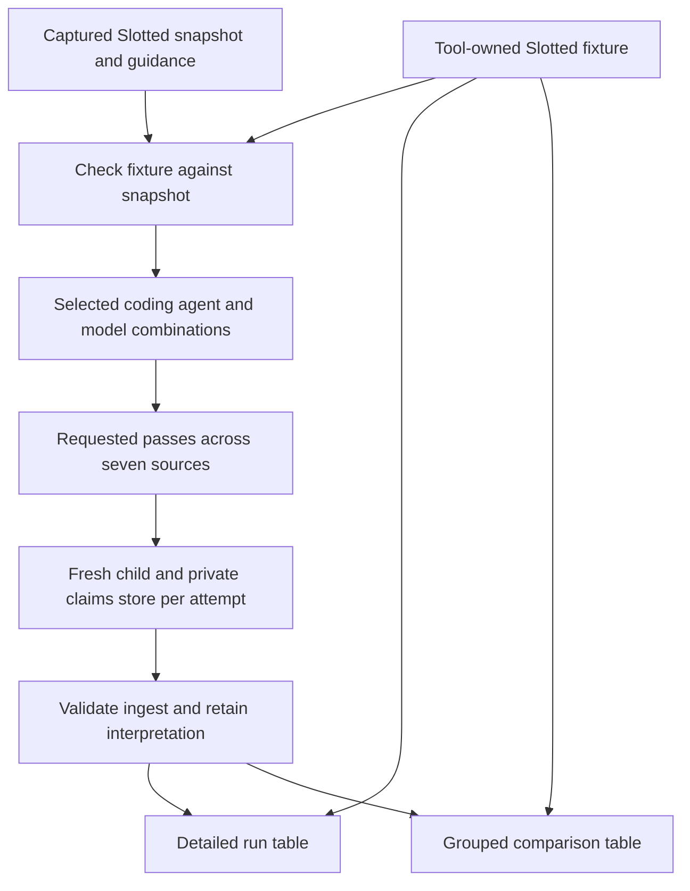
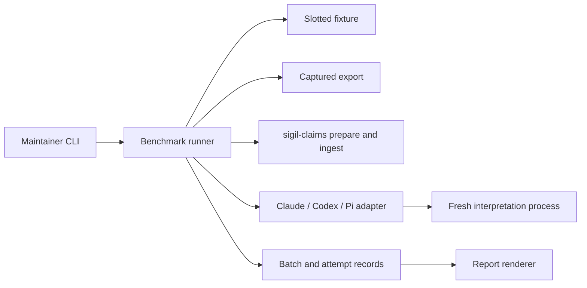
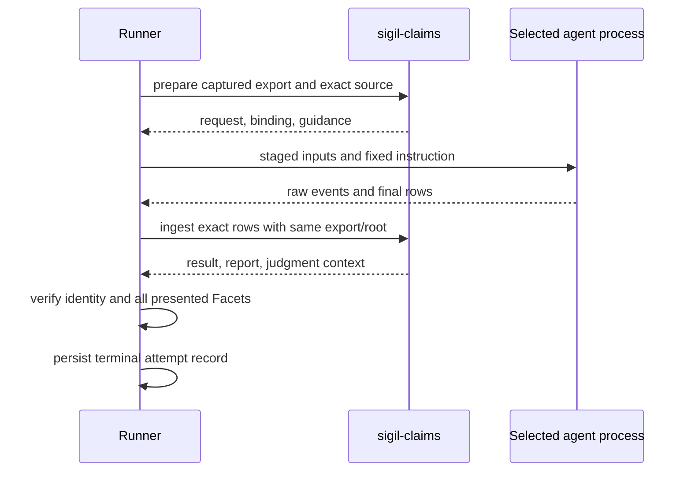
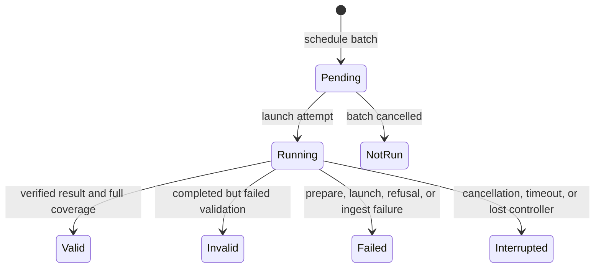
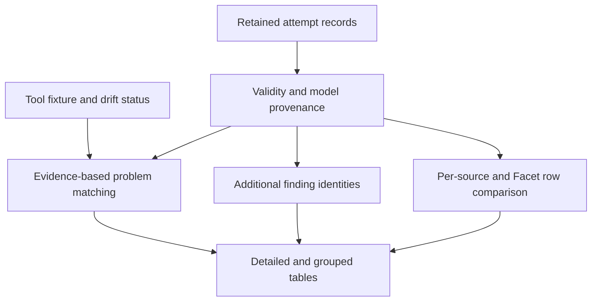

# Slotted interpretation benchmark - Plan

## Goal Capsule

- **Objective:** A Sigil maintainer can launch repeated Slotted claims evaluations for chosen coding agents and models, then inspect a labeled report to compare detection of known problems, additional findings, and variation between runs.
- **Means:** Use a standalone runner around the existing deterministic claims protocol (KTD1), with a tool-owned Slotted fixture and generated report.
- **Product authority:** The maintainer's 2026-10-02 brainstorm decisions, with the existing Slotted demo as the first fixture.
- **Open blockers:** None.
- **Execution:** Implement in this repository; the implementing agent verifies the workflow locally and hands off the completed change for review.

---

## Product Contract

### Summary

The benchmark covers the full seven-source Slotted fixture. A standalone runner launches fresh Claude, Codex, or Pi processes for selected models and passes, keeps the interpretation evidence, and builds detailed and grouped reports from the retained runs. Arbitrary fixtures and changes to the claims engine remain outside this release.

### Problem Frame

The current demo requires a maintainer to follow the claims plan by hand for every source and pass. Its Slotted source descriptions, planted-problem definitions, and target gradient live in `docs/computed-evaluation-demo.md`, so the benchmark cannot use them as its own reference without a second authority. The published table covers two passes, but the maintainer cannot set a repeat count for an automated run or tell from the saved claims results which agent and model produced each interpretation. The latest run notes also show variation in additional findings and one incomplete interpretation that ingest accepted until a separate script caught it.

### Key Decisions

- **Slotted is the first fixture.** (session-settled: user-directed — chosen over supporting any Sigil design from the start: the existing seven-source fixture can replace the manual workflow sooner.) Governs R1, R12.
- **Show separate measures without one rank.** (session-settled: user-directed — chosen over prioritizing one measure: detection of known problems, extra findings, and repeatability answer different questions.) Governs R9, R10.
- **The tool starts runs and makes the report.** The current manual launch and write-up are the work to replace. Governs R1, R8.
- **Provide run and comparison tables.** The full run table preserves individual outcomes; the grouped table makes agent/model comparisons readable. Governs R8, R9.
- **The benchmark owns the Slotted fixture definition.** (session-settled: user-directed — chosen over keeping the source and planted-problem descriptions in the demo doc: the tool must use them when it runs and reports.) Governs R10, R12–R15.
- **Keep batch evidence in an ignored repository analysis directory.** (session-settled: user-directed — chosen over temporary-only output: retained runs must be available for later analysis and diagnosis.) Governs R5, R16.

### Actors

- A1. Maintainer — selects the agent/model combinations and repeat count, starts the benchmark, and reviews its report.
- A2. Benchmark runner — acts as the claims host, starts a fresh selected coding-agent process for each source attempt, and records the model identity it can observe.
- A3. Interpretation child — reads the prepared request and returns claim rows.
- A4. `sigil-claims` — prepares each source and ingests the child's exact rows into a computed result and findings report.

### Requirements

**Batch runs**

- R1. The maintainer can start a Slotted benchmark for one or more selected coding-agent/model combinations, including Claude, Codex, and Pi, with a chosen positive number of passes.
- R2. A comparison batch uses one captured Slotted design snapshot and one fixed set of fixture definitions, claims guidance, and tool rules for every selected combination and pass.
- R3. Each pass evaluates all seven Slotted sources through the existing export, prepare, fresh-child, and ingest protocol; each selected-source attempt has an isolated private claims store.
- R4. The benchmark records each attempt's coding agent, requested model, observed model when available, relevant run settings, source, pass, and fixture and input identities; an unverified model identity is labeled as unverified.
- R5. The benchmark retains the prepared request, exact child-produced rows, ingest result, findings report, and judgment context for each attempt so a reader can inspect the interpretation behind an outcome.
- R6. Only a completed ingest with matching binding, report, artifact, and private-root identities contributes a computed state; missing facet coverage is flagged even if ingest accepts the rows.
- R7. Interrupted, refused, incomplete, or mismatched attempts remain visible with their failure step and no computed state; other scheduled attempts continue where possible without a silent retry.

**Report and comparison**

- R8. The report includes a detailed run table with one row per source attempt, naming its agent, requested and observed model, pass, source, validity, state, known-problem findings, additional findings, and a path to its evidence.
- R9. The report includes a comparison table grouped by agent, model identity and verification status, and source, showing valid and failed counts, state frequencies, known-problem detection frequencies, additional finding frequencies, and interpretation coverage.
- R10. The report keeps three views separate: detection of the four problems in the tool's fixture definition matched to their source and cited evidence, additional findings requiring review, and variation across valid repeated runs; it assigns no single overall rank.
- R11. A reader can compare child-produced claim rows by source and facet across attempts and open the original rows and cited finding evidence; an additional finding is not labeled a false positive without review.

**Demo handoff**

- R12. The Slotted demo documentation points to the tool-owned fixture description and presents the benchmark as its current run and reporting workflow, with the old two-pass table labeled as historical observation.

**Slotted fixture**

- R13. The benchmark owns and reports the Slotted fixture description: seven sources with their roles and imports, and the target state gradient.
- R14. The benchmark owns definitions of the four planted problems with their explanations, intended finding classes, evidence, and remedies; the report reads them from the tool rather than the demo doc.
- R15. Before comparing detection, the benchmark checks that the fixture's described sources and problem evidence still match the captured design; drift is reported and the affected known-problem metric is withheld rather than scored as a model miss.

**Output retention**

- R16. Benchmark batches remain in a gitignored directory under `analyze-demo/slotted-runs/`, with raw agent output and all generated evidence available for later analysis and diagnosis.

The comparison holds the input fixed while allowing interpretation to vary:



### Key Flows

- F1. **Launch and capture a batch.** **Trigger:** The maintainer selects combinations and a pass count. **Actors:** A1–A4. **Steps:** Check the fixture against one captured snapshot, run each source in each pass with a fresh child, ingest the exact rows, validate the result, and retain every attempt. **Outcome:** The batch has comparable evidence and an explicit status for every scheduled attempt. **Covers:** R1–R7, R13–R16.
- F2. **Inspect a comparison.** **Trigger:** The maintainer opens the generated report. **Actors:** A1. **Steps:** Scan the run and grouped tables, compare the three views, then open differing facet rows or finding evidence. **Outcome:** The maintainer can say what was observed for each agent/model combination and which differences need review. **Covers:** R8–R11, R13, R14.

### Acceptance Examples

- AE1. **Covers R1–R4, R8, R9.** **Given** two selected agent/model combinations and three passes, **When** a batch finishes, **Then** the run table has one labeled row for each of the 42 scheduled source attempts and the comparison table groups them by combination and source.
- AE2. **Covers R6–R10.** **Given** one Booking attempt omits an ownership-conflict interpretation while other attempts detect it, **When** the report is built, **Then** its detection frequency reflects the omission even if those attempts share the same final state.
- AE3. **Covers R6–R9.** **Given** a child omits many presented facets and ingest still accepts its rows, **When** the benchmark validates the attempt, **Then** the report flags incomplete coverage, preserves the rows, and excludes that attempt from valid-state frequencies.
- AE4. **Covers R4, R7–R9.** **Given** a selected host cannot confirm which model served an attempt, **When** the report is built, **Then** that attempt shows the requested model as unverified and is not represented as a verified same-model result.
- AE5. **Covers R8–R11.** **Given** one pass adds an `unguarded-flow` finding, **When** the report compares passes, **Then** it shows the extra finding and its underlying rows without automatically calling it a false positive or lowering a single aggregate score.
- AE6. **Covers R7–R9.** **Given** one selected agent cannot launch its child, **When** the batch runs, **Then** its scheduled attempts show the launch failure while the other selected agent's attempts can finish and appear in the same report.
- AE7. **Covers R10, R13, R14.** **Given** the demo doc is unavailable but the Slotted design still matches the tool's fixture, **When** the benchmark runs, **Then** the report describes the seven sources and four planted problems from the tool and measures their detection.
- AE8. **Covers R10, R14, R15.** **Given** a design edit removes the Booking exclusivity evidence, **When** the benchmark checks the fixture, **Then** it reports fixture drift and withholds that known-problem detection measure while still reporting valid computed states.
- AE9. **Covers R5, R16.** **Given** a completed or interrupted batch, **When** the maintainer opens its directory under `analyze-demo/slotted-runs/`, **Then** the raw agent output, per-attempt claims evidence, and report remain available locally and are ignored by Git.

### Scope Boundaries

- The first release benchmarks the existing seven-source Slotted fixture. Authoring arbitrary fixtures is deferred.
- The benchmark does not edit Slotted design prose, the four intentional problems, or the claims laws to improve a measured outcome.
- The demo doc does not remain an independent authority for the current Slotted source and problem descriptions.
- The report does not turn a small sample of runs into a universal claim that one agent or model is best.
- Raw run records remain under the gitignored `analyze-demo/slotted-runs/` analysis area, outside the Slotted design workspace; the report links to the retained local evidence.
- The existing advisory `sigil-evaluate` comparison remains separate from the computed benchmark.

### Dependencies / Assumptions

- The selected coding-agent hosts and requested models must be available to launch fresh interpretation children; unavailable configurations produce visible failed attempts under R7.
- Some hosts may expose only a requested model name. R4 and AE4 preserve that limit instead of asserting an unverified served model.
- The four planted Slotted problems become tool-owned reference labels for detection. Additional findings may be real design issues or interpretation mistakes until reviewed.

### Sources / Research

- `docs/plans/2026-09-24-0924-feat-slotted-compute-demo-plan.md` — the original seven-source, two-pass manual verification protocol and target gradient.
- `docs/computed-evaluation-demo.md` — current run steps, Slotted and planted-problem descriptions to move into the tool, two-pass results, and stated run limits.
- `analyze-demo/slotted-runs/DIAGNOSIS.md` and `analyze-demo/slotted-runs/analyze.py` — observed interpretation variance, incomplete coverage, and the existing analysis of saved artifacts.
- `integrations/skills/sigil-compute/references/computed-evaluation.md` — the source, isolation, delegation, ingest, and result-identity contract.
- `packages/sigilc/src/claims/cli.rs` — the claims CLI's boundary: it does not launch a model.

The original Product Contract's R1–R15, F1–F2, and AE1–AE8 retain their meaning and IDs. A2 now names the standalone runner as the host; the selected coding-agent process remains A3, the fresh interpretation child. R16 and AE9 record the later output-retention decision.

---

## Planning Contract

### Key Technical Decisions

- KTD1. **Keep orchestration outside `sigil-claims`.** A Deno runner under `scripts/` is A2; each Claude, Codex, or Pi CLI process is A3. The native CLI deliberately accepts external rows and does not launch models. This implements R1 and R3 without changing the claims engine (`packages/sigilc/src/claims/cli.rs`, `integrations/skills/sigil-compute/references/computed-evaluation.md`).
- KTD2. **Freeze a batch before launching children.** Capture one export and derive the source-byte manifest from its embedded source text; retain and reuse that exact export for every prepare and ingest. Save the serialized fixture definition and digest, claims executable and guidance identities, required skill content, child prompt, agent settings, and workspace memo-store presence as provenance. This benchmark deliberately starts each private root empty rather than copying the normal host's workspace seed, and requires `reusedUnits = 0` so each pass measures a new interpretation of every presented Facet. Governs R2–R4 and R6 (`packages/sigilc/src/claims/prepare.rs`, `packages/sigilc/src/claims/cli.rs`).
- KTD3. **Use a versioned tool-owned fixture.** Store the seven source descriptions, expected imports, target gradient, and four stable problem IDs with source prose anchors, finding class/law, explanation, and remedy in benchmark data. Resolve every anchor, including both sides of the Booking/Rooms ownership issue, to a unique Facet from the captured export and prepared requests; do not hard-code offset-based Facet IDs. The Calendar display-name issue also requires Identity to lack a display-name provider, so a newly supplied provider withholds that issue's metric even if Calendar's requirement text remains. Missing or ambiguous issue evidence withholds that issue's measure, while missing required sources prevents a seven-source batch. Governs R10 and R13–R15.
- KTD4. **Give each child a staged, recorded context.** Adapters start new noninteractive sessions in a temporary workspace outside the repository, containing only prepared inputs and pinned `sigil-understand` and `sigil-egglog` material. They use the same interpretation instruction, restrict available tools as each CLI permits, and retain raw host events, exact final-response bytes, effective flags, and observed model metadata in the ignored batch directory. The fixture answer key and previous runs stay outside the child workspace. Host claims of isolation and model identity are recorded as observed, unverified, or mixed; requested model alone is never proof of the served model. Governs R2–R5 and AE4.
- KTD5. **Persist the schedule and each attempt before report generation.** Write an immutable batch manifest and one durable attempt record per scheduled agent/model/pass/source tuple under the gitignored repository analysis area; execute sequentially in the first release. A record moves through pending, running, and a terminal result or failure. A report command rebuilds from these records without model calls; an abandoned running record becomes interrupted for reporting. Never retry a failed or interrupted attempt silently, and refuse an existing output directory for a new batch. Governs R1, R5, R7–R9, R16.
- KTD6. **Validate identity and complete presented-Facet coverage.** Preserve child output verbatim for ingest. Accept exit 1 as a possible valid Disjoint only when the structured result and report agree; compare source, state, binding/export digest, guidance fingerprint, vocabulary generation, interpretation digest, and private-root paths. Require at least one exact child row, including an explicit `reading`, for every `request.json.rows[].facet`, including contextual dependencies. A partial ingest report remains evidence but contributes no valid state. Governs R5–R7 and AE3 (`packages/sigilc/src/claims/prepare.rs`, `packages/sigilc/src/claims/context.rs`).
- KTD7. **Derive all comparisons from retained evidence.** Count a planted problem at most once per valid source attempt when a finding's class/law, one cited claim witness on a relevant anchored Facet, and issue-specific subject/object evidence match the fixture; native violation findings cite one witness even when the fixture has two prose anchors. Keep all other findings for review. Group by agent, requested model, observed model and verification status, and source; show scheduled/valid/failed counts and explicit numerators and denominators. Compare exact row content by source and Facet within the fixed batch, with no overall rank. Governs R8–R11 and R15 (`packages/sigilc/src/claims/findings.rs`).

### High-Level Technical Design

The topology keeps the deterministic claims engine separate from the agent adapters (KTD1, KTD4):



Each scheduled attempt follows the same protocol (KTD2, KTD6):



The durable record distinguishes work still scheduled from work that ran (KTD5):



Report derivation has three separate outputs (KTD3, KTD7):



The report's inclusion gates are explicit: `scheduled → terminal? → identity and coverage valid? → issue evidence intact? → detection denominator`. A failed or incomplete attempt remains in the detailed table; a drifted issue shows `N/A`, while other valid measures remain. This decision path prevents state counts from becoming false detection counts (KTD6, KTD7).

The maintainer surface is `run` with repeated agent/model selections, a positive pass count, an output directory, and an optional per-attempt timeout; `report` takes an existing batch directory and performs no launches. The concrete flag spelling can follow the repository's Deno CLI conventions, but these two commands and their meanings are the interface contract (KTD5).

### Output Structure

The new module directory groups the fixture, adapters, runner, validation, and reporting. Tests sit beside their target modules; `main.ts` owns the two commands.

```text
scripts/slotted-benchmark/
  fixture.ts          fixture_test.ts
  agents.ts           agents_test.ts
  batch.ts            batch_test.ts
  claims.ts           claims_test.ts
  report.ts           report_test.ts
  main.ts             integration_test.ts
```

### System-Wide Impact and Risks

- The selected agent may carry ambient instructions or read outside its staged workspace. Record effective restrictions and child tool events where available; if a host cannot prove strict isolation, state that limit in the report instead of claiming an identical execution environment (KTD4).
- A selected model may be unavailable, rate-limited, or silently substituted. Record requested and observed identity separately, and keep unavailable or mixed identities out of a verified same-model group (KTD4, KTD7).
- A long batch spends model calls. Run one child at a time, use a finite configurable per-attempt timeout, terminate the active process on cancellation, and persist partial evidence before continuing (KTD5).
- Prepared guidance is compiled into `sigil-claims`; a binary change during a batch can alter the task. Pin the executable used by every prepare/ingest and validate its binding identities (KTD2, KTD6).
- The report describes observed runs on one Slotted snapshot. Additional findings still need human review, and a small sample does not establish a universal agent/model ranking (R10–R11).

### Deferred Implementation Notes

- Establish each installed CLI's actual served-model event and clean-session behavior with a single-source smoke before relying on a verified-model label. If an adapter cannot obtain that event, its attempts remain explicitly unverified under R4; this does not block the runner.
- Choose the exact host-specific tool flags and prompt transport during adapter implementation, then record them in batch provenance. They must meet KTD4's child-context contract without assuming all three CLIs expose identical controls.

---

## Implementation Units

### U1. Tool-owned fixture and drift preflight

- **Goal:** Give the benchmark one authoritative Slotted definition and identify which known-problem measures remain scorable after a design edit.
- **Requirements:** R2, R10, R12–R15; AE7–AE8; KTD3.
- **Dependencies:** None.
- **Files:** `scripts/slotted-benchmark/fixture.ts`, `scripts/slotted-benchmark/fixture_test.ts`.
- **Approach:** Move the seven source roles/imports, target states, and four problem descriptions out of the demo's authority into stable fixture records. Resolve each issue's prose anchors against captured export text and prepared Facets, and check the Calendar issue's absent-provider condition against Identity. Retain a per-issue drift reason and check the seven exact source paths before scheduling.
- **Patterns to follow:** `docs/computed-evaluation-demo.md` for existing fixture facts; `packages/core/src/design-input.ts` and `packages/sigilc/src/claims/prepare.rs` for export and Facet shape.
- **Test scenarios:**
  - Covers AE7. With the demo doc unavailable and the unchanged Slotted export, preflight resolves seven sources and four issue IDs from the tool fixture.
  - Covers AE8. Remove Booking's exclusivity sentence from a captured export; the ownership issue becomes unscorable while the other issue anchors remain usable.
  - Add an Identity display-name provider while leaving Calendar's requirement text intact; preflight withholds only the Calendar unmet-obligation metric.
  - Give an anchor that matches two Facets; preflight reports ambiguity instead of choosing one by order.
  - Remove a required source; preflight refuses a seven-source batch before any child launch.
- **Verification:** Every fixture record resolves to the current Slotted snapshot or has a specific drift status, with no runtime read of the demo doc.

### U2. Fresh Claude, Codex, and Pi interpretation adapters

- **Goal:** Start each selected agent/model in a fresh session with the prepared child context and retain exact output and provenance.
- **Requirements:** R1–R5, R7; AE4, AE6; KTD1, KTD2, KTD4.
- **Dependencies:** U1 for fixture and batch context boundaries.
- **Files:** `scripts/slotted-benchmark/agents.ts`, `scripts/slotted-benchmark/agents_test.ts`.
- **Approach:** Add small non-shell process adapters for the three installed CLIs. Stage prepared files and pinned skills in a temporary workspace outside the repository, excluding fixture labels and earlier run artifacts; copy raw output back to the retained batch directory. Capture raw events, final response bytes, exit status, host version, settings, timeout/cancellation result, and served-model events when present. Pass the exact final response to the claims layer without repair.
- **Execution note:** Prove the clean-session and final-response behavior with one prepared source per real host before building aggregate claims around adapter metadata.
- **Patterns to follow:** `integrations/skills/sigil-compute/references/computed-evaluation.md` for the child handoff; current `claude`, `codex exec`, and `pi` CLI help for flags.
- **Test scenarios:**
  - A fake host given one staged request emits rows and a model event; the adapter retains byte-identical rows and labels the observed model.
  - A host returns only a requested model echo; the attempt remains unverified.
  - A host emits two distinct served-model IDs; the attempt is marked mixed instead of attributed to one model.
  - Covers AE6. One host executable is unavailable; its launch fails with a recorded step while a different host can still run.
  - A child times out or is cancelled; its process ends and partial event output remains available.
  - The child-facing prompt and staged files contain no fixture answer key or prior run, and the effective host restrictions are recorded.
- **Verification:** A live one-source smoke for each available host shows fresh context, exact output capture, and honest model provenance; fake-host cases cover failures without paid calls.

### U4. Exact ingest and benchmark validity

- **Goal:** Decide which attempts have a trustworthy computed state and complete child interpretation.
- **Requirements:** R5–R7, R9; AE2–AE3; KTD6.
- **Dependencies:** U1.
- **Files:** `scripts/slotted-benchmark/claims.ts`, `scripts/slotted-benchmark/claims_test.ts`.
- **Approach:** Accept a caller-supplied captured frontend and private root, then drive prepare and ingest against those exact inputs. Retain prepared files, raw child rows, native result, report, context, and process output. Validate the native identity fields and paths, then check all presented request Facets against child rows and context coverage; store validity and the failed step separately from any native state.
- **Patterns to follow:** `integrations/skills/sigil-compute/references/computed-evaluation.md` for exit and identity semantics; `packages/sigilc/tests/claims_cli.rs` and `packages/sigilc/tests/claims_context.rs` for native cases.
- **Test scenarios:**
  - A matching Disjoint result exits 1 with a matching report and full rows; it is valid and keeps state `disjoint`.
  - Covers AE3. Omit a contextual Rooms Facet from Booking rows; ingest evidence remains, but the benchmark marks coverage incomplete and withholds the state.
  - A `reading` row for every presented Facet counts as complete coverage even when it asserts no claim.
  - A report digest, source, or path points outside the attempt root; validation rejects its state and records the mismatch.
  - A refused or malformed child output produces a failed attempt with its exact bytes retained.
- **Verification:** Native ingest acceptance alone never establishes benchmark validity; every valid state has matching identity and complete presented-Facet coverage.

### U3. Batch scheduling, snapshot, and attempt ledger

- **Goal:** Turn selected combinations and pass count into durable, isolated source attempts that can be reported after interruption.
- **Requirements:** R1–R5, R7, R16; F1, AE1, AE6, AE9; KTD2, KTD5.
- **Dependencies:** U1, U2, U4.
- **Files:** `scripts/slotted-benchmark/batch.ts`, `scripts/slotted-benchmark/batch_test.ts`, `analyze-demo/slotted-runs/.gitignore`.
- **Approach:** Capture one export, derive its source hashes, save the resolved fixture snapshot and batch identity, and schedule the full Cartesian set before launches. Place retained batches under `analyze-demo/slotted-runs/benchmarks/`, with a fresh empty private root and preparation directory for every attempt. Persist an attempt record before starting its child and after each terminal outcome. Add the exact benchmarks directory to `.gitignore` and retain raw agent events, stdout, stderr, rows, and claims artifacts for local diagnosis.
- **Test scenarios:**
  - Covers AE1. Two combinations and three passes schedule exactly 42 distinct source attempts, all tied to one snapshot and fixture digest.
  - A zero or negative pass count, duplicate selection, or existing output directory fails preflight without a model call.
  - A nonempty workspace interpretation store is recorded in provenance, while each attempt still prepares from an empty private root with zero reused units.
  - Covers AE6. A launch failure records that attempt and later scheduled attempts still execute.
  - A controller ends with one running record; report reconstruction marks it interrupted and leaves never-started records visible without retrying either.
  - Covers AE9. A partial batch leaves its raw host events and claims artifacts under the ignored analysis directory for a later report rebuild.
- **Verification:** The persisted manifest and records explain every scheduled attempt, even for a partial or cancelled batch; Git ignores the output and no run writes to the Slotted design workspace.

### U5. Evidence-based comparison and report

- **Goal:** Produce the detailed run table, grouped comparison table, and three separate evidence views from retained records.
- **Requirements:** R4, R8–R11, R13–R15; F2, AE1–AE5, AE7–AE8; KTD3, KTD7.
- **Dependencies:** U1, U3, U4.
- **Files:** `scripts/slotted-benchmark/report.ts`, `scripts/slotted-benchmark/report_test.ts`.
- **Approach:** Build a Markdown report from the batch ledger and saved fixture snapshot, with relative links to exact rows, native reports, and context. Match each known issue using issue-specific class/law, one cited witness on a relevant anchored Facet, and subject/object evidence, counting once per valid attempt. Show remaining findings by stable identity for review; compare exact row content by source and Facet; render scheduled/valid/failed counts and separate frequency denominators by agent, requested/observed model status, and source.
- **Test scenarios:**
  - Covers AE2. Two Booking attempts share `disjoint`, but only one cites the range-change evidence; detection shows `1/2` despite equal states.
  - Three findings for one planted contradiction count as one issue detection, with the other findings still inspectable.
  - A Booking ownership finding cites one Booking witness while both Booking and Rooms fixture anchors are intact; it counts once without requiring two finding claim IDs.
  - Covers AE4. Verified, unverified, and mixed served-model attempts remain distinct groups.
  - Covers AE5. An extra `unguarded-flow` finding appears with its claim link and is not labeled a false positive or converted into a rank.
  - Covers AE8. A drifted ownership anchor renders its measure `N/A`; valid state frequencies and other issue frequencies still render.
  - Two valid attempts with equal state and findings but different rows for one Facet show the exact source/Facet difference and link to both retained row artifacts.
  - A failed and an incomplete attempt stay in the detailed table but do not enter valid-state or detection denominators.
- **Verification:** The report can be regenerated from retained records with no child launch and contains one row per scheduled attempt plus a grouped row for every agent/model/source combination.

### U6. Maintainer commands and demo handoff

- **Goal:** Make the benchmark runnable and make its fixture and report the current Slotted workflow.
- **Requirements:** R1, R8–R9, R12–R14; F1–F2; KTD1, KTD5.
- **Dependencies:** U1–U5.
- **Files:** `scripts/slotted-benchmark/main.ts`, `scripts/slotted-benchmark/integration_test.ts`, `deno.json`, `docs/computed-evaluation-demo.md`.
- **Approach:** Expose `run` and `report` through a Deno task, validate selected agent/model pairs, pass count, and output path, and print the report path and batch completion status. Add focused benchmark check/test tasks to the root check/test gates. Replace the demo's current source/problem authority with a pointer to `fixture.ts`; label the existing two-pass observations historical and link the new run command. Keep the manual analysis scripts as historical evidence.
- **Test scenarios:**
  - A run command with one valid combination and one pass schedules seven source attempts and writes both report tables using fake host processes.
  - A report command on a retained partial batch rewrites the report without invoking a model.
  - An unknown agent or missing model selector fails with a clear input error before export or child launch.
  - The demo remains readable without a live batch and points to the tool fixture for the seven-source and four-problem definitions.
- **Verification:** A maintainer can run a full seven-source batch for an available combination, then reopen the report and its evidence; the current demo instructions use the benchmark, while the old two-pass table is explicitly historical.

---

## Verification Contract

| Gate | Evidence required |
| --- | --- |
| Focused benchmark tests | A new `deno task test:slotted-benchmark` runs the focused cases for fixture drift, all 42 scheduled rows, adapter capture, native-result validation, denominators, same-state row variation, and report regeneration; root `test` includes this task. |
| Repository checks | `deno task fmt`, `deno task lint`, and `deno task check` pass; root `check` includes a new `check:slotted-benchmark` task that type-checks the new runner and tests. |
| Claims protocol | `deno task build:cli`, `deno task build:sigilc`, and `deno task test:sigilc` cover the current export binary and `sigil-claims` prepare/ingest tests; benchmark integration checks the runner's use of them. |
| Live adapter proof | One prepared-source smoke per available Claude, Codex, and Pi host records the actual child-facing context, exact output, and observed or unverified model identity. |
| End-to-end Slotted proof | At least one available agent/model combination completes a seven-source pass; inspect its report, evidence links, full Facet coverage, and fixture match. Record unavailable hosts as a verification limit rather than inventing results. |

Behavioral skill evaluation is not required because this change adds a maintainer CLI workflow and does not change an installed skill. `release:validate` does not apply; no release artifact is being prepared.

---

## Definition of Done

- All R1–R16 requirements and AE1–AE9 examples are represented by implemented behavior and the verification evidence above.
- The fixture is tool-owned; the demo points to it, and its historical two-pass table no longer claims to be the current comparative benchmark.
- A batch can be launched for any selected positive pass count and selected Claude, Codex, or Pi model pairs; every scheduled source attempt has a durable record and evidence link or explicit failure step.
- The detailed and grouped tables show agent/model provenance, validity, states, known-problem detection, additional findings, and repeat variation with explicit denominators and no overall rank.
- No incomplete or mismatched attempt contributes a valid state or detection count; drift withholds only affected known-problem measures.
- Focused tests, repository checks, native protocol validation, and available live smoke evidence pass. Any host whose credentials or model are unavailable is named as unverified rather than represented as tested.
- Abandoned experimental code and obsolete generated records are removed from the change before handoff; unrelated local plans and historical run evidence remain untouched.
