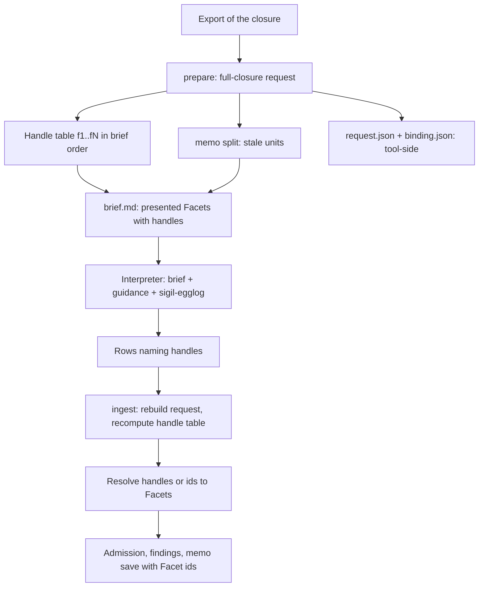
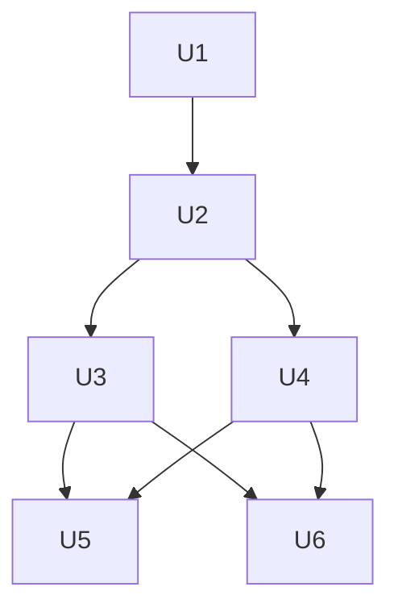

# Compact interpretation brief - Plan

## Goal Capsule

- **Objective:** A small local model, such as Qwen3.8 with a 16K output limit, can interpret a Sigil source's claims preparation into valid, fully covered rows for more Slotted sources than the one of seven it manages today.
- **Means:** `sigil-claims prepare` presents a plain-text design brief with short Facet handles in place of the JSON request (R1–R9). It also ships trimmed guidance (R10).
- **Product authority:** The maintainer's 2026-10-05 brainstorm decisions. The claims design in `packages/sigilc/claims.sigil` is revised to match (R13).
- **Open blockers:** None.
- **Execution:** Implement in this repository in U-ID order. The implementing agent verifies the Verification Contract locally and hands off for review. The maintainer runs the live Qwen3.8 batch after merge.
- **Product Contract preservation:** restructured, no scope change: R7 now states the handles span the whole closure (resolving the deferred handle-scheme question). Changed: R16 added, from a planning-time decision the maintainer approved. The Dependencies note on ingest coverage was corrected against the code. The deferred questions were resolved in place.

---

## Product Contract

### Summary

`sigil-claims prepare` will give the interpreting model a plain-text design brief instead of `request.json` and `binding.json`.
The brief is grouped by component and section, with one short-handle line per Facet.
The model writes rows that name those handles, and `ingest` maps the handles back to Facet ids.
The guidance is rewritten for the brief and trimmed, so a small model's required reading drops to about a quarter of today's.

### Problem Frame

For `examples/slotted/availability.sigil`, a 4,161-byte source, the interpreter must read 44,017 B of `request.json`, 3,018 B of `binding.json`, 30,456 B of guidance across four files, and about 10 KB of skill files.
That totals about 88 KB.
The request presents the source's whole import closure, which is 81 Facets of which 23 belong to availability.
Prose makes up only 12.7 KB of the request.
The rest is URNs, labels, and paths repeated on every row, pretty-printing, and a second copy of the binding.

In the Pi + `r9700/Qwen3.8` batch (`analyze-demo/slotted-runs/benchmarks/pi-full-validation-20261002`), only `identity.sigil` was valid, at 16 of 16 Facets.
That source has no imports.
Slotted, rooms, availability, booking, and calendar each spent the full 16,384-token output limit and stopped on `length` before writing any rows.
Shared stopped normally and returned none.
Input size was moderate, at 30K to 59K total tokens.
What failed is that the model had to read a dense JSON payload and then write one full-id row set for every closure Facet, all inside one output budget.

The benchmark never benefits from the memo.
The memo would skip already-interpreted units, but each attempt starts with an empty store (`manifest.json`: `workspaceMemoPresent: false`), so every run pays for the full closure.

### Key Decisions

- **Whole-closure coverage stays.** Only the presentation changes, not what one interpretation call is responsible for. Governs R5. (session-settled: user-directed — chosen over own-Facets-only and one-unit-per-call: the maintainer wants the call scope unchanged and the payload made smaller)
- **A design brief replaces the JSON request.** Format research found JSON comparatively poor for long-context reading, while id-first lines did well. Governs R1–R4. (session-settled: user-approved — chosen over the annotated `.sigil` source and over YAML/Markdown-KV records: it presents exactly the Facets to cover, one numbered line each, in the shape the research favoured)
- **Short handles in both input and output.** Output tokens are where Qwen ran out, and full ids like `facet:availability.sigil:1537` repeat on every row. Governs R7–R9. (session-settled: user-approved — chosen over input-only shrinking and over a freer output format: it cuts output size while keeping the egglog row kinds)
- **Guidance is rewritten for the brief and trimmed.** Once the request shrinks, the fixed guidance and skill reading would be most of what the model reads. Governs R10, R11. (session-settled: user-approved — chosen over a format-only update and over merging guidance into the brief)
- **The size target gates the benchmark.** A smaller payload counts as success only if Qwen's validity moves. See Success Criteria. (session-settled: user-directed — chosen over a size-only target, a benchmark-only target, and a no-regression-on-large-models bar)
- **Benchmark settings stay fixed.** Holding them fixed keeps the before/after comparison about the format alone. Governs R15.
- **`sigil-understand` leaves the interpreter's required reading.** The brief already labels each Facet's component and role, and the guidance's role table covers what a role means. Governs R16. (session-settled: user-approved — chosen over raising the size gate to ~35 KB and over a ~30 KB gate: the brief plus four skill files alone would fill a 25 KB gate)

### Requirements

**The brief**

- R1. `sigil-claims prepare` writes a plain-text design brief, and the brief is the only request file the interpreter is told to read.
- R2. The brief groups Facets by source, then component, then contract role. Each Facet is one line: its short handle followed by its exact prose slice.
- R3. A component's Logic Facets are presented together in source order, and each keeps its own handle.
- R4. The brief lists the closure's admissible entities and each source's imports in plain lines that name components and Tags by label, not by URN.
- R5. The brief presents every Facet the request presents today, meaning the whole resolved closure less any units the memo already holds. An interpretation is complete only when every presented handle has rows.
- R6. The binding stays a tool-only input to `ingest`, and the interpreter is not required to read it.

**Handles**

- R7. Every Facet in the request's resolved closure gets a short handle that the closure alone determines, including Facets the memo holds and the brief does not present. The interpreter writes that handle wherever a row names a Facet today.
- R8. `ingest` resolves every handle to its Facet before admission. It refuses a row that names a handle the request did not issue. Row kinds and column meanings are otherwise unchanged.
- R9. Stored interpretations stay keyed on Facet identity, never on handles. Renumbered handles therefore never make an unchanged unit stale.

**Guidance and skills**

- R10. The compiled guidance describes the brief and handles, and it is trimmed to what an interpreter needs: one worked example per contract role, as `CompiledGuidance` already commits.
- R11. The `sigil-egglog` skill and the compiled guidance keep agreeing on every returned row kind and refusal token.
- R12. The `sigil-compute` computed-evaluation flow hands its interpreter the brief instead of `request.json`.
- R16. An interpreter's required reading is the brief, the compiled guidance, and the `sigil-egglog` skill. `sigil-understand` becomes optional background, in both the benchmark and the `sigil-compute` flow.

**Design and benchmark**

- R13. The claims design's `InterpretationRequest` and `CompiledGuidance` are revised through `sigil-write` before the code changes. Today the design commits to "one pre-filled row per Facet".
- R14. Only the presentation layer is in scope. `sigil export design` and the export it produces are unchanged.
- R15. The Slotted benchmark prompt and harness use the brief and handles. Its coverage check counts handles. Its output limit, thinking budget, and timeout are unchanged.

### Acceptance Examples

- AE1. **Covers R7, R8.** Given a prepared availability brief that issues handles `f1` to `f81`, when the interpreter returns a row naming `f82`, then `ingest` refuses that row as naming a handle the request did not issue.
- AE2. **Covers R5, R15.** Given the same brief, when the returned rows cover `f1` to `f80` and omit `f81`, then the interpretation is incomplete and the benchmark records it as invalid coverage.
- AE3. **Covers R9.** Given availability's units are stored from an earlier run, when a Facet is added to `identity.sigil` and availability's handles shift on the next prepare, then availability's unchanged units are still reused from the memo.
- AE4. **Covers R3.** Given a component whose Logic section spans three Facets, when the brief is written, then those three Facets appear together in source order, each on its own handle line.

### Success Criteria

- **Size gate (checked first):** the total required reading for `availability.sigil` is under about 25 KB, down from about 88 KB. That total counts the brief plus guidance plus the skill files the prompt requires.
- **Benchmark (checked after the gate passes):** a Pi + `r9700/Qwen3.8` batch on the Slotted fixture returns valid, fully covered results for more than one of the seven sources, with the settings fixed per R15. `slotted.sigil`, with 169 Facets, is the stretch case, not the bar.

### Scope Boundaries

- Narrowing what one call covers, such as own-Facets-only or one unit per call, is out (per R5).
- Changing the benchmark's output limit, thinking budget, or timeout is out (per R15).
- A freer output format beyond short handles is out. The egglog row kinds stay.
- Building the annotated-source or YAML/KV presentations as extra benchmark arms is out.
- Token-squeezing formats such as TOON or CSV for the Facet prose are out. Independent tests rank them low on accuracy.

**Deferred to Follow-Up Work**

- A larger-model batch (Codex or Claude) on the new format, as an informal regression check beside the Qwen run.
- Context-only brief lines that would let a Guard name a constraint Facet whose unit the memo holds (KTD4).

### Dependencies / Assumptions

- Trimming the guidance changes its fingerprint, and every memo key includes that fingerprint (`packages/sigilc/src/claims/memo.rs`). All stored interpretations go stale once and are re-interpreted.
- The request layout changes incompatibly, so directories prepared under the current format must be re-prepared.
- The "incomplete presented Facet coverage" check lives only in the benchmark harness (`scripts/slotted-benchmark/claims.ts`). Rust `ingest` does not check per-Facet coverage. It reports roles with no rows, for the selected source, as findings (`packages/sigilc/src/claims/identity.rs`).
- Format effects vary by model (Sclar et al. 2024). The benchmark, not the research, settles whether the brief helps Qwen.

### Sources / Research

- `packages/sigilc/src/claims/prepare.rs`: `REQUEST_FORMAT` history and closure widening (lines 18–30). `presenting` narrows rows and flows only (lines 155–178).
- `packages/sigilc/claims.sigil`: `CompiledGuidance` and `InterpretationRequest` interface (lines 59–93).
- `packages/sigilc/tests/claims_egglog_skill.rs`: drift tests for row kinds and refusal tokens.
- `scripts/slotted-benchmark/agents.ts` line 57: the child prompt. `scripts/slotted-benchmark/claims.ts` lines 127–129: the coverage check.
- `analyze-demo/slotted-runs/benchmarks/pi-full-validation-20261002/report.md` and `attempts/*/evidence/child/stdout.jsonl`: the Qwen3.8 failures.
- Sclar et al., ICLR 2024, "Quantifying Language Models' Sensitivity to Spurious Features in Prompt Design" (arXiv 2310.11324): format swings of up to 76 points on a 13B model.
- OpenAI GPT-4.1 prompting guide, long-context section: document tags and id-first lines did well, and JSON "performed particularly poorly".
- ImprovingAgents input-format benchmark: Markdown-KV and YAML ahead of JSON on record lookup with small models. TOON and CSV rank low on accuracy.
- Tam et al., EMNLP Industry 2024, "Let Me Speak Freely?": forced structured output degrades reasoning.
- Liu et al., TACL 2024, "Lost in the Middle": a U-shaped position effect, which favours instructions at the start and end.

---

## Planning Contract

### Key Technical Decisions

- KTD1. **Handles are numbered over the whole closure, in brief order.** Brief order is source (in the binding's sorted closure order), then component, then contract role, then source offset. Handles run `f1` to `fN` across the closure, and a warm memo leaves gaps in the numbering. `ingest` never reads `request.json`. It rebuilds the request from the export and re-runs the memo split (`packages/sigilc/src/claims/cli.rs`), so numbering only the presented subset could silently attach rows to the wrong Facet if the store changed between prepare and ingest. Handles also must not follow the request's row order, which sorts Facet ids as text and puts `:1000` before `:999`. Governs R7, R8. (session-settled: user-approved — chosen over numbering only the presented Facets and over per-source prefixes: only a closure-wide numbering can be recomputed safely at ingest, and it keeps second readings of reused units admissible)
- KTD2. **`ingest` resolves handles in every column that names a Facet, and also accepts a full Facet id there.** That means column 0 of every row, plus the `value` of a `guard` row whose operand is `constraint`. Resolution runs right after the dialect parse, before the requested-Facet check, and again for `--claims-repeat`. `memo::save` therefore only ever sees Facet ids. Accepting ids mirrors entity names, which accept a label or an id, and keeps existing fixtures valid. Governs R8, R9. (session-settled: user-approved — chosen over handle-only rows: it keeps current fixtures and tests valid at no cost to the brief)
- KTD3. **`request.json` stays as a tool-side record, and the interpreter is told to read only the brief.** Each row gains its handle. `REQUEST_FORMAT` goes to 5, because the brief renderer is not fingerprinted and a layout change would otherwise slip past the binding check. The benchmark stages only the brief and guidance into the child's workspace, and keeps `request.json` and `binding.json` on the controller side. Governs R1, R6, R15. (session-settled: user-approved — chosen over deleting `request.json`: the harness coverage check, batch counts and fixture preflight read its rows)
- KTD4. **A Guard naming a constraint Facet whose unit the memo holds stays unreachable, as it is today.** The brief presents what the request presents today, and the request already filters such Facets out. Governs R5, R8. (session-settled: user-approved — chosen over context-only brief lines for referenceable Facets: that is new presentation scope, deferred)
- KTD5. **An entity whose label is shared within the closure is listed with its full id.** Every other entity is listed by label alone. Entity-name admission already accepts a label or an id and refuses an ambiguous label (`packages/sigilc/src/claims/identity.rs`), so ingest is unchanged. Governs R4.
- KTD6. **The brief is a Markdown text file.** It opens with a two-line header saying that every `[fN]` line needs rows, and closes with the same instruction, because research favours instructions at both ends of the context. The entity and import lists come first, then the Facets. A brief that presents nothing says so in one line, which the `sigil-compute` empty-artifact rule needs. Governs R1–R4, R12.
- KTD7. **Guidance stays four compiled documents, trimmed to about 8 KB in total.**
  - `examples.md` keeps exactly one worked example per contract role. That is seven blockquote-and-fence pairs, the test floor in `packages/sigilc/tests/claims_guidance.rs`.
  - `rejected.md` keeps only the refusal tokens and one line on each refusal case.
  - `sections.md` keeps the role table that the language-authority test checks.
  - `vocabulary.md` keeps every row kind and the strings its drift tests require.
  
  Keeping the bundle shape avoids rewriting the fingerprint and bundle tests for a merge that would save little. Governs R10, R11.

### High-Level Technical Design

Data flow after the change. Handles are computed once from the full-closure request. The model sees only the brief and guidance, and `ingest` recomputes the same table.

Handle numbering, cold and warm, illustrated for availability:

| Situation | Handles issued | Lines in the brief |
| --- | --- | --- |
| Empty memo | `f1`–`f81` | all 81 |
| Identity, Rooms and SharedKernel units stored | `f1`–`f81` | the 23 availability Facets only, with gaps where the others would be |

### Assumptions

- The trimmed guidance plus the brief keeps today's larger-model validity. That is not measured in this plan; see Deferred to Follow-Up Work.
- The brief adds roughly 10% over prose alone, based on the brainstorm-time estimate. That estimate gave availability about 14.2 KB, and every Slotted source a cut of 3.0× to 3.8× against `request.json` plus `binding.json`.

### Sequencing

U1 lands first, because the design governs the claims code. U2 and U3 change the protocol together. U4 and U5 rewrite the text that describes it. U6 switches the benchmark and adds the size gate.

---

## Implementation Units

### U1. Revise the claims design for the brief

- **Goal:** The claims design commits to a brief with handles instead of pre-filled rows.
- **Requirements:** R1–R9, R13; KTD1–KTD4.
- **Dependencies:** None.
- **Files:**
  - Modify `packages/sigilc/claims.sigil` (`InterpretationRequest` interface and decisions; `CompiledGuidance` only if its wording names the request format).
  - Modify `packages/sigilc/_module.sigil` only if a new Tag must be listed there.
- **Approach:**
  1. Use the `sigil-write` skill. Replace "emit one pre-filled row per Facet" with the brief and closure-wide handles that ingest resolves.
  2. State that a returned Facet reference may be a handle or a Facet id.
  3. If U2 adds a new claims module, give it an owning Tag. `packages/sigilc/tests/claims_cli.rs` requires every claims module to be owned by one.
  4. Keep the prose short. The mechanism detail stays in this plan and in code comments.
- **Patterns to follow:** The existing `InterpretationRequest` decision text in the same file, which records why the request widened.
- **Test scenarios:**
  - Test expectation: none. This is design text. Proof is `sigil check .` coming back clean, plus the `sigil-write` delegated review.
- **Verification:** `sigil check .` reports no diagnostics for `packages/sigilc`, and the revised text no longer mentions pre-filled rows.

### U2. Render the brief and the handle table in prepare

- **Goal:** `sigil-claims prepare` writes `brief.md` and a handle-bearing `request.json`, both computed from one handle table.
- **Requirements:** R1–R7, R14; KTD1, KTD3, KTD5, KTD6; covers AE4.
- **Dependencies:** U1.
- **Files:**
  - Create `packages/sigilc/src/claims/brief.rs`, or extend `packages/sigilc/src/claims/prepare.rs`.
  - Modify `packages/sigilc/src/claims/mod.rs`, `packages/sigilc/src/claims/prepare.rs` (`FacetRow`, `REQUEST_FORMAT`, `write`), and `packages/sigilc/src/claims/cli.rs` (prepare stdout).
  - Test in `packages/sigilc/tests/claims_prepare.rs`.
- **Approach:**
  1. Compute the handle table from the full-closure `Request` before `presenting` narrows it, so prepare and ingest share one pure function.
  2. Add the handle to each `FacetRow`, and bump `REQUEST_FORMAT` to 5 with a doc-comment line in the existing history style.
  3. Render the brief from the presented request. Each Facet's prose is whitespace-collapsed onto one line.
  4. `write` adds the brief to the files it already emits.
- **Patterns to follow:**
  - `prepare::project` and `presenting` for the closure and stale-unit shapes.
  - The determinism test (byte-identical output across runs) in `tests/claims_prepare.rs`.
- **Test scenarios:**
  - A closure with two sources gets handles in source → component → role → offset order. A Facet at offset `1000` is numbered after one at offset `999`.
  - Preparing the same input twice yields a byte-identical `brief.md` and `request.json`.
  - Covers AE4. A component whose Logic section spans three Facets yields those three consecutive lines, in source order, under one Logic heading.
  - With a warm memo holding one dependency's units, the brief omits those Facets, and the remaining handles keep their cold-run numbers.
  - An entity label shared by two components appears with both full ids. An unshared label appears alone.
  - A request that presents zero units yields a brief with only the empty-request line.
  - The written file count rises by one over the current bundle-plus-two assertion.
- **Verification:** The brief for the shared test input reads as grouped plain lines with no URNs, apart from ambiguous entities. `request.json` carries a `handle` on every row.

### U3. Resolve handles at ingest

- **Goal:** `ingest` admits rows that name handles or full Facet ids, and refuses unissued handles.
- **Requirements:** R7–R9; KTD1, KTD2, KTD4; covers AE1, AE3.
- **Dependencies:** U2.
- **Files:**
  - Modify `packages/sigilc/src/claims/cli.rs` (after the dialect parse, and in the `--claims-repeat` path).
  - Modify `packages/sigilc/src/claims/dialect.rs` only if `Row` needs a rewrite helper.
  - Test in `packages/sigilc/tests/claims_cli.rs` and `packages/sigilc/tests/claims_dialect.rs`.
- **Approach:**
  1. Recompute the handle table from the rebuilt full-closure request.
  2. Rewrite column 0 of every row, and the `value` of `guard` rows whose operand is `constraint`, from handle to Facet id. Leave the values of other operands untouched.
  3. A token shaped like a handle that the table does not hold is refused, naming the handle.
  4. The existing "did not ask about" refusal and the second-reading path then run unchanged on Facet ids.
- **Patterns to follow:** The existing refusal tests in `tests/claims_cli.rs`, and the entity label-or-id resolution in `identity.rs`.
- **Test scenarios:**
  - Rows naming `f1`… for every presented Facet are admitted with the same state as the equivalent full-id rows.
  - Covers AE1. A row naming a handle one past the closure's last is refused, and the message names that handle.
  - A row naming a full Facet id is still admitted, so existing fixtures pass unchanged.
  - A `guard` row with operand `constraint` naming a handle resolves to that Constraints Facet. A `guard` with operand `input` whose literal value is `f3` stays the literal `f3`.
  - A row naming the handle of a reused unit's Facet is admitted as a second reading, mirroring the existing zero-presented-Facets test.
  - Covers AE3. After an interpretation is stored, adding a Facet to a source that sorts earlier in the closure (`identity.sigil` before `rooms.sigil`) shifts the later source's handles on re-prepare. That source's unchanged units are still reused, and their stored rows hold Facet ids rather than handles.
  - `--claims-repeat` resolves handles against the same table.
- **Verification:** All existing `claims_cli` tests pass, and the new handle scenarios pass.

### U4. Rewrite and trim the guidance and the `sigil-egglog` skill

- **Goal:** The compiled guidance describes the brief and handles in about 8 KB, and the `sigil-egglog` skill agrees with it.
- **Requirements:** R10, R11, R16; KTD7.
- **Dependencies:** U2.
- **Files:**
  - Modify `packages/sigilc/src/claims/guidance/sections.md`, `vocabulary.md`, `examples.md` and `rejected.md`.
  - Modify `integrations/skills/sigil-egglog/SKILL.md` and `integrations/skills/sigil-egglog/references/dialect.md`.
  - Test in `packages/sigilc/tests/claims_guidance.rs` and `packages/sigilc/tests/claims_egglog_skill.rs`.
- **Approach:**
  1. Replace the pre-filled-row wording with handle wording. Today it appears as `rows`/`flows` in `vocabulary.md`, `entities`/`imports` in `sections.md`, and the opening of `examples.md`.
  2. Cut `examples.md` to one example per role.
  3. Cut `rejected.md` to its refusal tokens plus the new unissued-handle refusal.
  4. Update the backtick allowlists in the guidance tests only for tokens the new text needs.
  5. In `sigil-egglog`, change "`sigil-understand` remains the design-language authority" to describe it as optional background for the brief.
- **Patterns to follow:** The existing guidance tests, which pin role-table agreement, reading outcomes and refusal tokens.
- **Test scenarios:**
  - The guidance-floor tests still pass: seven example pairs, the entity-mention floor, the role table matching the language authority, and a statement for each reading outcome.
  - The drift tests pass: every returned row kind is named in the skill, and the skill and guidance agree on every refusal token, including the new one.
  - Combined guidance size is under 9,000 bytes, as a new assertion in `tests/claims_guidance.rs`.
  - `extract-guidance` writes the four trimmed documents, and the fingerprint changes from the current value.
- **Verification:** The guidance and skill tests pass, and `deno task test:skill` passes.

### U5. Hand the brief through `sigil-compute`

- **Goal:** The computed-evaluation flow gives its child the brief, the guidance and `sigil-egglog`, not `request.json` or `sigil-understand`.
- **Requirements:** R12, R16; KTD6.
- **Dependencies:** U3, U4.
- **Files:**
  - Modify `integrations/skills/sigil-compute/references/computed-evaluation.md` (files written, the handoff field table, required skills, the empty-request case).
  - Modify `integrations/skills/sigil-compute/SKILL.md` (the lines naming `sigil-understand` as required).
  - Modify `packages/sigilc/README.md` (its `request.json` description).
- **Approach:** Replace the `request` handoff field with a `brief` field. Keep `binding` as host-only, passed to ingest, not to the child. Keep the existing rule that a request presenting nothing still goes through one child that returns an empty artifact on purpose.
- **Patterns to follow:** The existing handoff table and completion rules in `computed-evaluation.md`.
- **Approach note:** `sigil-compute` keeps `sigil-understand` as a declared foundation dependency in `scripts/validate-skill.ts`. The host still links to it, and only the child's required reading drops it.
- **Test scenarios:**
  - `deno task test:skill` passes with `sigil-compute`'s declared dependencies unchanged, and every documentary link in the revised text resolves.
  - `deno task test:skill:native` passes with the revised skill text. If it pins `request.json` or `sigil-understand` as a required child skill, update those expectations to the brief.
- **Verification:** No skill text tells an interpreter to read `request.json`. `sigil-understand` appears only as optional child reading, while it stays a declared skill dependency.

### U6. Switch the Slotted benchmark to the brief and add the size gate

- **Goal:** The benchmark child reads only the brief, guidance and `sigil-egglog`. Coverage is counted by handles, and an automated test enforces the size gate.
- **Requirements:** R15, R16, Success Criteria (size gate); KTD3; covers AE2.
- **Dependencies:** U3, U4.
- **Files:**
  - Modify `scripts/slotted-benchmark/agents.ts` (prompt and staging), `scripts/slotted-benchmark/claims.ts` (coverage, preparation loading), `scripts/slotted-benchmark/batch.ts` (presented-Facet counts, skill copying) and `scripts/slotted-benchmark/fixture.ts` (preflight anchors).
  - Test in `scripts/slotted-benchmark/agents_test.ts`, `claims_test.ts`, `integration_test.ts` and `fixture_test.ts`.
- **Approach:**
  1. Stage only `brief.md` and the four guidance files into the child's `preparation/`. The prompt names the brief, the guidance, and the `sigil-egglog` SKILL plus `dialect.md`.
  2. Coverage stays keyed on Facet ids. Ingest has already resolved handles (KTD2), so the existing comparison of `request.json` rows against the judgment context is unchanged. The incomplete-coverage message names each missing Facet's handle, from its `request.json` row, as well as its id.
  3. Output limit, thinking budget and timeout stay untouched.
  4. The fake agent in `integration_test.ts` reads `preparation/brief.md`. It emits one row per `[fN]` line using that handle, takes the section from the enclosing role heading, and takes the prose from the line for the planted-contradiction match.
- **Patterns to follow:** The existing staged-workspace and coverage tests in `claims_test.ts` and `agents_test.ts`.
- **Test scenarios:**
  - The staged child workspace contains `preparation/brief.md` and the guidance, and does not contain `request.json` or `binding.json`.
  - The prompt names the brief and `sigil-egglog`, and does not name `request.json` or `sigil-understand` as required.
  - Covers AE2. Rows covering every presented handle but one report incomplete coverage, naming the missing Facet.
  - The fake-agent integration run, answering with handles, reaches the same valid outcome as before.
  - Size gate: preparing `examples/slotted/availability.sigil` gives `brief.md` plus the four guidance files plus `sigil-egglog/SKILL.md` and `references/dialect.md` under 25,600 bytes in total.
  - Preflight still matches every planted-problem anchor in the fixture.
- **Verification:** `deno task test:slotted-benchmark` and `deno task check:slotted-benchmark` pass, and the size-gate test passes.

---

## System-Wide Impact

- **Stored interpretations:** the guidance fingerprint and `REQUEST_FORMAT` both change, so every memo entry goes stale once and re-interprets on next use.
- **Prepared directories:** a directory prepared under format 4 is refused at ingest by the binding's format check and must be re-prepared.
- **Benchmark history:** batches before and after this change measure different protocols. Report comparisons as format 4 against format 5, not as a single series.
- **Larger interpreters:** they lose the full-id rows, the extra examples and the required `sigil-understand`. Full-id rows stay accepted (KTD2), so a stale prompt still works.

## Risks

| Risk | Mitigation |
| --- | --- |
| Trimmed guidance lowers row quality for models that pass today | The follow-up larger-model batch, plus guidance tests that keep every row kind and refusal token. |
| Qwen still spends its 16K output limit on thinking even with the smaller brief | The success bar is more than one of seven sources, not all seven; `slotted.sigil` is the stretch case. |
| The seven-example floor leaves no slack for future roles | A new role needs a new example anyway; the test stays as the guard. |
| A handle-shaped literal in a non-constraint `guard` value is rewritten by mistake | KTD2 limits rewriting to Facet-naming columns; a U3 scenario covers the `input` operand. |

---

## Verification Contract

| Gate | Command | Applies to |
| --- | --- | --- |
| Design check | `sigil check .` | U1 |
| Rust tests | `deno task test:sigilc` | U2, U3, U4 |
| Skill validation | `deno task test:skill` and `deno task test:skill:native` | U4, U5 |
| Benchmark tests | `deno task test:slotted-benchmark` | U6 |
| Type check, format, lint | `deno task check`, `deno task fmt`, `deno task lint` | U6 and all Deno edits |
| Full suite | `deno task test` | before hand-off |
| Live benchmark (maintainer, after merge) | `deno task slotted-benchmark` with the Pi + `r9700/Qwen3.8` agent, settings as today | Success Criteria (benchmark) |

## Definition of Done

- Every unit's verification holds, and the full `deno task test` suite passes.
- The size-gate test passes: availability's required reading is under 25,600 bytes.
- No interpreter-facing text (guidance, `sigil-egglog`, `sigil-compute`, benchmark prompt) tells an interpreter to read `request.json` or requires `sigil-understand`.
- `packages/sigilc/claims.sigil` matches the shipped behaviour, and `sigil check .` is clean.
- Abandoned or experimental code from approaches that did not pan out is removed from the diff.
- The live Qwen3.8 batch is left to the maintainer. Its result, more than one of seven sources valid, decides whether the Objective was met.
